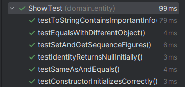
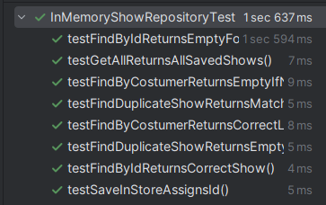

# US312 - Add Figure to a Proposal

## 4. Tests

This section documents the **unit tests**, **integration tests**, and other **validation procedures** developed for this User Story to ensure the functionality of adding a figure to a `ShowProposal` works as expected.

### Test Cases

1. **Unit Test: Figure Active Status Validation**

    * **Description**: Verifies if the system correctly validates that the selected `Figure` is active.
    * **Scenario**: Attempt to add a figure to a `ShowProposal` when the figure is inactive.
    * **Expected Outcome**: The system should throw an exception with the message "Selected figure is inactive or unavailable".

2. **Unit Test: Figure Exclusivity Validation**

    * **Description**: Verifies if the system validates that the figure is either public or exclusive to the customer.
    * **Scenario**: Attempt to add a figure to a `ShowProposal` that is neither public nor exclusive to the customer.
    * **Expected Outcome**: The system should throw an exception with the message "Figure not available for this customer".

3. **Unit Test: Consecutive Figure Repetition**

    * **Description**: Verifies if the system prevents adding a figure that repeats consecutively in the sequence.
    * **Scenario**: Add a figure to a `ShowProposal` that already contains the same figure as the last one in the sequence.
    * **Expected Outcome**: The system should throw an exception with the message "Consecutive repetition not allowed".

4. **Unit Test: Successful Figure Addition**

    * **Description**: Verifies if a figure can be successfully added to a `ShowProposal` when all conditions are met.
    * **Scenario**: Add a valid, active, public figure to a `ShowProposal` with no consecutive repetition and valid drone type mappings.
    * **Expected Outcome**: The figure should be added to the `ShowProposal`’s sequence.

5. **Integration Test: Add Figure with Inventory Validation**

    * **Description**: Verifies if the system correctly validates inventory limits when adding a figure to a `ShowProposal`.
    * **Scenario**: Attempt to add a figure with drone type mappings that exceed the available inventory.
    * **Expected Outcome**: The system should throw an exception with the message "Drone model count exceeds inventory".

6. **Integration Test: Persistence of ShowProposal**

    * **Description**: Verifies if the updated `ShowProposal` is correctly persisted after adding a figure.
    * **Scenario**: Add a figure to a `ShowProposal` and save it using the repository.
    * **Expected Outcome**: The `ShowProposal` should be persisted with the new `FigureExecution`.

7. **UI Integration Test: Add Figure from UI**

    * **Description**: Validates the user interface flow for adding a figure via the console UI.
    * **Scenario**: Simulate user interactions with `AddFiguresToProposalUI`, selecting a proposal and adding figures.
    * **Expected Outcome**: The system should allow figure selection, prevent invalid actions (e.g., duplicate selection), and persist the changes.

8. **Service Validation Test: Prevent Consecutive UI Selection**

    * **Description**: Verifies if the figure selection service prevents choosing the same figure twice consecutively.
    * **Scenario**: Attempt to select the same figure back-to-back via console.
    * **Expected Outcome**: The system should show an error message and not allow the selection.

---

## 5. Construction (Implementation)

This section describes the implementation logic for **Add Figure to a Proposal**, based on **Domain-Driven Design (DDD)**, **SOLID**, and **GoF** design patterns.

### Controller: `AddFigureToProposalController`

**Responsibilities**:

* Receives user inputs from the UI.
* Validates the proposal and updates its figure sequence.
* Interacts with the `ShowProposalRepository` for persistence.

**Design Principles**:

* **SRP (Single Responsibility Principle)**: Delegates validations and persistence.
* **DDD**: Delegates logic to services, keeping controllers thin.

### UI Component: `AddFiguresToProposalUI`

**Responsibilities**:

* Guides the user through selecting a proposal and adding figures.
* Displays existing figures and prevents invalid actions.

**Design Highlights**:

* **Interactive flow**: step-by-step prompts.
* **Input validation**: prevents empty, invalid, or consecutive figure choices.
* **Separation of concerns**: delegates core logic to controller and service classes.

### Service Layer: `ServiceForValidSequenceFiguresForShow`

**Responsibilities**:

* Ensures valid figure selection logic (e.g., no consecutive repetition).
* Presents UI-friendly options (undo, clear, confirm).

**Design Principles**:

* **OCP (Open/Closed Principle)**: Easily extendable logic for figure validation.
* **Modular interactions**: Decouples figure validation from controller/UI.

### Factory: `FigureExecutionFactory`

**Responsibilities**:

* Creates `FigureExecution` instances with valid mappings.

**Design Patterns**:

* **Factory Pattern**: Encapsulates creation logic and enforces domain invariants.

### Repository: `ShowProposalRepository`

**Responsibilities**:

* Save and retrieve `ShowProposal` instances.

**Design Principles**:

* **Repository Pattern**: Abstracts persistence mechanism.
* **ISP (Interface Segregation Principle)**: Offers focused repository functions.

---

### Implementation Strategy

1. **User Input**:

    * Select a `ShowProposal`.
    * View current figures.
    * Select new figures.

2. **Validations**:

    * **Figure Active**.
    * **Availability (Public or Exclusive)**.
    * **No Consecutive Repetition**.
    * **Inventory Compatibility**.

3. **Creation and Update**:

    * Use `FigureExecutionFactory` to create new execution.
    * Update proposal and persist via repository.

4. **Confirmation**:

    * Notify user of successful update or errors.

### DDD Elements

* **Aggregate Root**: `ShowProposal`.
* **Entities**: `ShowProposal`, `FigureExecution`.
* **Value Objects**: `DroneTypeMapping`, `ShowProposalAuthor`.
* **Bounded Context**: Proposal creation and update logic.

### Patterns Summary

* **Factory**: `FigureExecutionFactory`.
* **Repository**: `ShowProposalRepository`.
* **Service**: `AddFigureToProposalService`, `ServiceForValidSequenceFiguresForShow`.
* **Controller/UI**: `AddFiguresToProposalController`, `AddFiguresToProposalUI`.
