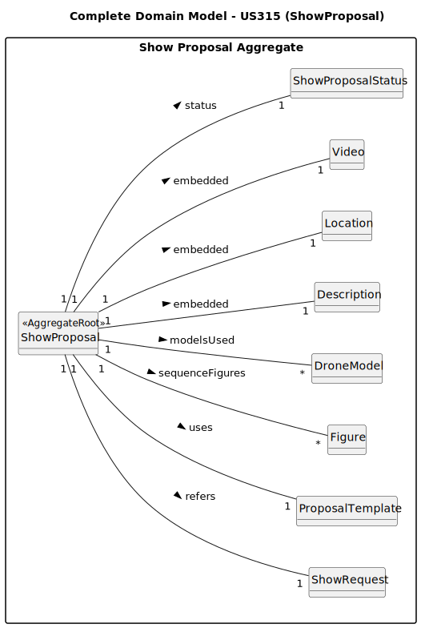

# US315 - Add Video of Simulation to the Proposal

## 2. Analysis

### 2.1. Relevant Domain Model Excerpt

This diagram presents the updated domain model for proposal management, extended to support the attachment of a **simulation video** to a **Proposal**. It introduces a new association between proposals and video metadata, ensuring all relevant information required to manage and render simulation previews is properly represented.

While the base domain model for proposals covers customers, shows, and pricing, this excerpt focuses specifically on enriching the **Proposal** entity with video-related attributes and lifecycle awareness.

This level of detail is important because:

- It supports the functional requirement of adding and updating simulation videos linked to proposals.
- It enables proper validation (e.g., format, size) and lifecycle controls (e.g., allowing replacements while editable).
- It lays the foundation for UI integration, such as embedded video previews for customers.

#### **Explanation of the model elements**

- **ShowProposal** (`<<Entity>>`): Central entity representing a show proposal sent to a customer. Now extended with:
  - References to `Show Request` (`<<AggregateRoot>>`) and `ProposalTemplate` (`<<AggregateRoot>>`) to link related data.
  - Associations to multiple `Figures` (`<<AggregateRoot>>`) representing the sequence of show elements.
  - Associations to multiple `DroneModel` (`<<AggregateRoot>>`) indicating the drones planned for the show.
  - Embedded value objects for `Description`, `Location`, and `Video` containing respective details.
  - `Name` (`<<ValueObject>>`) for the proposal’s identifying title.
  - `ShowProposalStatus` (`<<ValueObject>>`) reflecting the workflow state (e.g., *Draft*, *StandBy*), controlling video upload/edit permissions.

- **Show Request** (`<<AggregateRoot>>`): The originating request for the show, linked to the proposal.
- **ProposalTemplate** (`<<AggregateRoot>>`): Template used as a basis for creating the proposal.
- **Figures** (`<<AggregateRoot>>`): The visual elements or choreography pieces used in the show.
- **DroneModel** (`<<AggregateRoot>>`): Models of drones involved in the show.

This domain view captures the minimal yet complete structure needed to support video functionality in proposals, while ensuring tight integration with authentication and editing workflows.

### 2.2. Other Remarks

This enriched model is optimized for secure handling and controlled presentation of simulation videos. The design ensures:
- **Traceability and ownership** of uploaded content (who uploaded, when).
- **Secure and accessible storage** integration, abstracted from the core domain.
- **Enforced validation and replacement rules** based on proposal status.

The model is structured for future enhancements, such as:
- Supporting video previews in mobile or shared views.
- Logging download/play events for auditing.
- Adding support for multiple video formats or transcodings.
