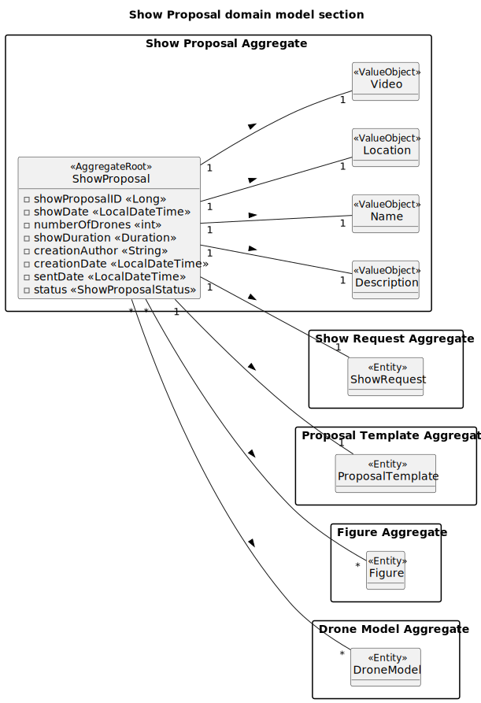

# US316_US371 - Send_Accept_Reject Show Proposal

## 2. Analysis

### 2.1. Relevant Domain Model Excerpt

The following diagram illustrates the updated and complete domain model for the **ShowRequest and ShowProposal** functionality. It includes all relevant attributes and associations required for implementation, traceability, and auditing.

#### **Explanation of the model elements**

- **ShowProposal** (`<<Entity>>`):  
  Represents a proposal for a show created in response to a customer’s show request. It includes key attributes:

  - `showProposalID`: Primary key (surrogate, auto-generated).
  - `showDate`: The scheduled date and time of the show.
  - `numberOfDrones`: The number of drones used in the proposal.
  - `showDuration`: The planned duration of the show.
  - `creationAuthor` / `creationDate`: Audit fields for who created the proposal and when.
  - `sentDate`: Date when the proposal was sent to the customer.
  - `status`: The current status of the proposal (e.g., STAND_BY, ACCEPTED, REJECTED).

- **ShowRequest** (`<<Entity>>`):  
  Represents a customer’s request for a show. Each proposal (`ShowProposal`) is linked to exactly one request, ensuring traceability and alignment with customer demands.

- **Name** (`<<ValueObject>>`):  
  Holds the name of the proposal. Enforces constraints on length, allowed characters, and case-insensitive uniqueness.

- **Description** (`<<ValueObject>>`):  
  Captures details about the show’s content and narrative. Subject to validation for meaningful content and length.

- **Location** (`<<ValueObject>>`):  
  Specifies the physical or virtual location for the proposed show.

- **Video** (`<<ValueObject>>`):  
  Stores a video file or URL associated with the show proposal, useful for customer preview.

- **DroneModel** (`<<Entity>>`):  
  Represents a specific drone type used in the show. Stored in a map with quantities to track resource usage.

- **Figure** (`<<Entity>>`):  
  Represents a figure (animation or pattern) to be included in the show. Each `ShowProposal` can contain multiple figures.

- **ProposalTemplate** (`<<Entity>>`):  
  A predefined layout or design template that can be applied to proposals to ensure consistency and efficiency.

---

This detailed model supports:

- Full **auditability** of proposals and requests, including who created or modified them and when.
- Enforcement of **domain constraints** on name, description, and status.
- Easy **traceability** from each show proposal back to the customer’s original show request.
- Support for **extensibility** as future features like template management or dynamic figure inclusion are added.
- The ability to manage drone resources and integrate with figure classification for richer show experiences.

> This version of the domain model reflects the most up-to-date understanding of requirements and ensures compliance with business rules for show request and proposal management.
