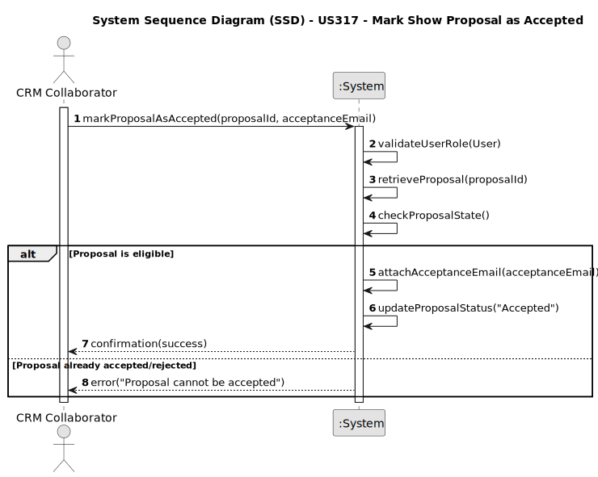

# US317 - Mark Show Proposal as Accepted

## 1. Requirements Engineering

### 1.1. User Story Description

As a CRM Collaborator, I want to mark the proposal as accepted by the customer by attaching the customer’s acceptance email.

### 1.2. Customer Specifications and Clarifications

- This user story represents the final step in the negotiation workflow of a show proposal.
- The acceptance must be explicitly confirmed via an email from the customer.
- The system must persist the proposal status update and the associated customer email.
- Only CRM Collaborators can perform this operation.
- A proposal can only be marked as accepted if it has not been rejected previously and has not already been accepted.

**Clarifications**

Q: What happens if someone tries to accept an already accepted/rejected proposal?
A: The system must block the operation and return an appropriate error message.

### 1.3. Acceptance Criteria

* AC1: Only CRM Collaborators can mark a proposal as accepted.
* AC2: The system must validate that the proposal is eligible for acceptance (it has not been accepted or rejected before).
* AC3: Upon acceptance, the proposal status must be updated and persisted in the database.
* AC4: Only proposals in "Sent to Customer" state are eligible for acceptance.

### 1.4. Found out Dependencies

* US316 – Sending the proposal to the customer must occur before US317.
* NFR07 – Persistence of proposal state and email attachment must be ensured.
* US372 – Accepted proposals will later be scheduled (Check show dates).
* NFR08 – Authentication/authorization must be enforced.
* 
### 1.5 Input and Output Data

**Input Data:**

* Proposal ID
* Acceptance email

**Output Data:**

* Status update confirmation
* Updated proposal state visible in the system

### 1.6. System Sequence Diagram (SSD)

### 1.7 Other Relevant Remarks

None