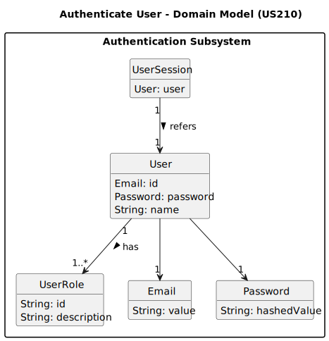

# US210 - Authentication and authorization

## 2. Analysis

### 2.1. Relevant Domain Model Excerpt 

### 2.2. Other Remarks
* Authentication Framework: The AuthFacade module from EAPLI must be used to validate user credentials and retrieve the authenticated user context.
* Password Storage: Passwords must be securely stored using a strong hashing algorithm (bcrypt). Plain-text passwords are strictly prohibited.
* Session Lifecycle: User sessions should automatically expire after a predefined period of inactivity. A manual logout mechanism must also be provided.
* Authorization Enforcement: Role-based access control must be strictly enforced at the application service level, ensuring that only users with the correct roles can perform specific operations.
* Future Readiness: The system architecture should be designed to support multiple roles per user and two-factor authentication (2FA/MFA) in future versions, if required.
