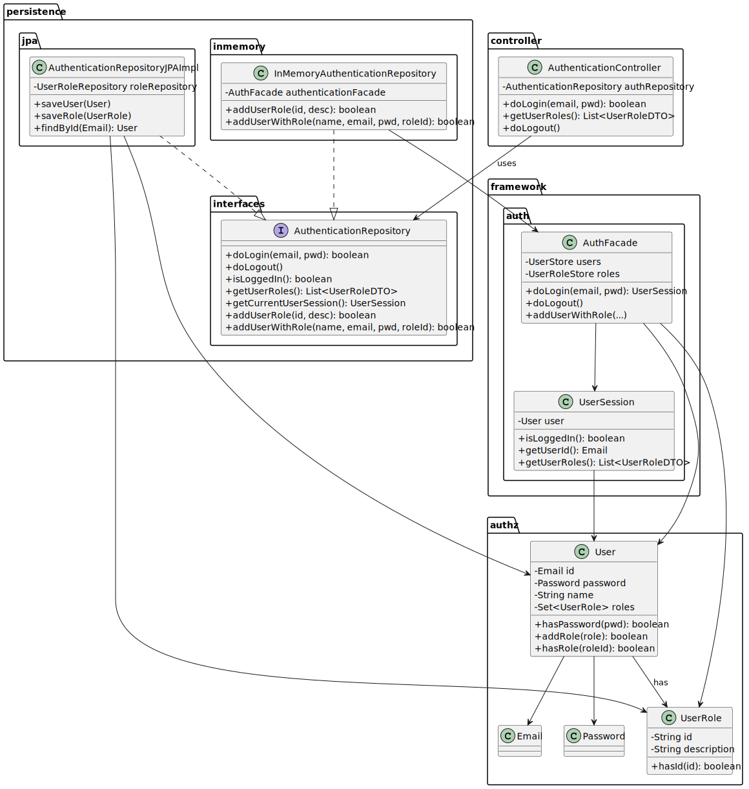

# US210 - Authentication and authorization

## 3. Design

### 3.1. Design Overview

The design for US210 implements user authentication and role-based authorization in the Shodrone back-office system. This functionality ensures that only authenticated users with valid roles can access and execute system operations according to their assigned responsibilities.
The authentication process follows these high-level steps:

1. **User Interaction**: The user provides login credentials (email and password) via a console-based UI.

2. **Authentication**: The system validates the credentials using the AuthFacade, which interacts with the UserStore.

3. **Session Management**: If the credentials are valid, a UserSession is created and persisted in the system.

4. **Authorization**: Role-based access is enforced using the User.hasRole(...) method.

5. **Logout**: The user can log out, invalidating their session and revoking access.

The design follows a layered architecture, ensuring modularity, testability, and clear separation of concerns:

- **UI Layer**: Handles user input and displays feedback through the EAPLI console.

- **Application Layer**: The AuthenticationController coordinates the authentication workflow.

- **Domain Layer**: Contains domain entities such as User, UserRole, UserSession, Email, and Password.

- **Persistence Layer**: Abstracted via the AuthenticationRepository interface, with JPA and in-memory implementations (as required by NFR07).

- **Infrastructure Layer**: The AuthFacade, UserStore, and UserRoleStore implement the authentication and session logic.

### 3.2. Sequence Diagrams

3.2.1. Class Diagram
The following class diagram models the authentication domain and infrastructure. It includes the User, UserRole, AuthenticationRepository, AuthenticationController, and supporting classes such as AuthFacade and UserSession.

3.2.2. Sequence Diagram (SD)
The sequence diagram below illustrates the login process from user input to session creation and feedback:

### 3.3. Design Patterns (if any)

Domain-Driven Design (DDD) Patterns
- Application Service
AuthenticationController acts as an application service, coordinating login/logout actions without embedding domain logic.

- Repository
AuthenticationRepository abstracts persistence, enabling JPA or in-memory strategies transparently.

- Factory
UserSession creation is handled via factory methods to guarantee valid and consistent object construction.

- Aggregate Root
The User entity serves as an aggregate root, encapsulating identity, credentials, and roles.
