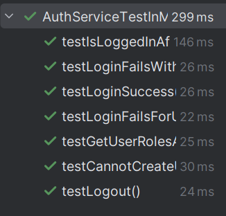
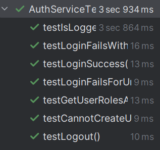

# US210 - Authentication and authorization

## 4. Tests

This section documents the unit tests, integration tests, and validation strategies used to verify the login and session functionality of the system.
You should include:

### **Test Cases**

1. **Unit Test: Successful Login**
   * **Description**: Verifies that a user can log in with valid credentials.
   * **Scenario**: A user with a known email and password attempts to log in.
   * **Expected Outcome**: The login is successful, and the session is marked as active.
   * **Test**:
   ```java
     void testLoginSuccess() {
     boolean result = repo.doLogin("admin@shodrone.app", "Admin123!");
     assertTrue(result);
     }
    ```

2**Login Fails with Wrong Password**
    * **Description**: Verifies that login fails with an incorrect password.
    * **Expected Outcome**: The user should not be authenticated.
    * **Test**:
   ```java
     void testLoginFailsWithWrongPassword() {
    boolean result = repo.doLogin("admin@shodrone.app", "WrongPassword");
    assertFalse(result);
    }
   ```
    
3**Unit Test: Login Fails for Unknown User**
    * **Description**: Ensures login fails when the user does not exist.
    * **Test**:
   ```java
    void testLoginFailsForUnknownUser() {
    boolean result = repo.doLogin("nonexistent@shodrone.app", "pass");
    assertFalse(result);
    }
   ```

4**Unit Test: Is Logged In After Successful Login**
* **Description**: Ensures the session is considered active after login.
* **Test**:
   ```java
   void testIsLoggedInAfterLogin() {
    repo.doLogin("admin@shodrone.app", "Admin123!");
    assertTrue(repo.isLoggedIn());
    }
   ```

5**Unit Test: Logout Clears Session**
* **Description**: Validates that the session is terminated on logout.
* **Test**:
   ```java
   void testLogout() {
    repo.doLogin("admin@shodrone.app", "Admin123!");
    repo.doLogout();
    assertFalse(repo.isLoggedIn());
    }
   ```

6**Duplicate Email Not Allowed**
* **Description**: Ensures that duplicate user creation fails.
* **Scenario**: Attempts to add two users with the same email.
* **Expected Outcome**: The second attempt returns false.
* **Test**:
   ```java
   void testCannotCreateUserWithDuplicateEmail() {
    repo.addUserWithRole("Test User", "dup@shodrone.app", "Dup123#", AuthenticationController.ROLE_ADMIN);
    boolean result = repo.addUserWithRole("Test User 2", "dup@shodrone.app", "OtherPass1!", AuthenticationController.ROLE_ADMIN);
    assertFalse(result);
    }
   ```

7**Get Roles After Login**
* **Description**: Verifies if the user’s roles are correctly returned after login.
* **Scenario**: Logs in and checks the returned roles list.
* **Expected Outcome**: The list contains the expected role.
* **Test**:
   ```java
   void testGetUserRolesAfterLogin() {
    repo.doLogin("admin@shodrone.app", "Admin123!");
    var roles = repo.getUserRoles();
    assertNotNull(roles);
    assertTrue(roles.stream().anyMatch(r -> r.getId().equals(AuthenticationController.ROLE_ADMIN)));
    }
   ```

### Screenshots



## 5. Construction (Implementation)

**Controller**: AuthenticationController
The AuthenticationController orchestrates authentication-related operations, including login, logout, and user/role creation.

**Responsibilities**:
* Delegates login and logout requests to the authentication repository.
* Adds new users with specified roles.
* Fetches user session data and role information.
* Works as the entry point between UI/API and the domain layer.

**DDD Principle**:
* The controller simply delegates to domain repositories and value objects, ensuring that logic lives within the domain or service layers.

**Entities & Value Objects**:
* **User(Entity)**:
Represents a system user with identity (Email) and state (roles, password).
Contains methods like hasPassword(...) for encapsulating credential checks.

* **Password (Value Object)**:
Securely hashes passwords using BCrypt upon creation.
Validates rules: at least 1 uppercase letter, 3 digits, and 1 special character.
Encapsulates comparison logic (checkPassword(...)).

* **Email (Value Object)**:
Ensures the user identity is validated and immutable.

* **UserRole (Entity)**:
Represents the access level of a user, stored and managed independently.

**Persistence Layer**:

**AuthenticationRepository Interface**:
* Abstracts access to authentication and user data (login, roles, session management).

**Implemented by**:
* InMemoryAuthenticationRepository for fast, isolated testing.
* AuthenticationRepositoryJPAImpl for real persistence using JPA and H2.

**RepositoryProvider**:
* Decides dynamically which repository implementation to use (inMemory vs JPA).
* Enables flexibility for testing vs production environments.

* **Authentication Workflow**
**User Creation**:
* Roles are first created via addUserRole(...).
* Users are then added with addUserWithRole(...), which validates uniqueness and binds the role.

**Login Flow**:
* Login request invokes repo.doLogin(email, password).
* Password verification is done via Password.checkPassword(...).
* Upon success, a UserSession is created and tracked.

**Session Management**:
* isLoggedIn() checks current session state.
* doLogout() clears the current session.
* getUserRoles() fetches the roles of the authenticated user.