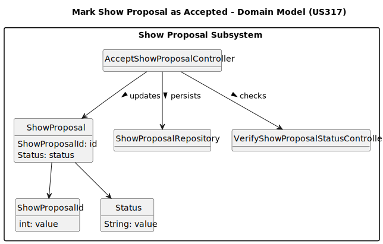

# US317 - Mark Show Proposal as Accepted

## 2. Analysis

### 2.1. Relevant Domain Model Excerpt 

### 2.2. Other Remarks
* Proposal State Validation:
  Only proposals with the status CUSTOMER_APPROVED are eligible to be marked as accepted.
  This validation is performed by the method wasShowProposalSent(...) in VerifyShowProposalStatusController.

* Status Transition:
  Upon validation, the system updates the status of the ShowProposal to COLLABORATOR_APPROVED via the setStatus(...) method.

* Show Creation:
  The proposal is passed to CreateShowController#createShowFromProposal(...), which:
- Fetches the associated ShowRequest
- Checks for duplicate shows (same location/date/customer)
- Constructs a new Show entity if no conflicts are found

* Persistence Layer:
  If the show is successfully created, both the updated proposal and the show are persisted using:
- ShowProposalRepository#saveInStore(...)
- ShowRepository#saveInStore(...)

* Access Control:
  Only users authenticated as CRM Collaborator have access to this feature.
  This is enforced via the menu available in CRMCollaboratorUI, which includes the "Accept Show Proposal" option.
  (Assumes authentication and authorization are handled via EAPLI’s AuthService.)

* User Feedback:
  The UI informs the user whether the operation was successful or failed using Utils.printSuccessMessage(...) or printFailMessage(...).

* Error Handling:
  If a proposal is not eligible (already accepted, rejected, or not sent), the system throws an IllegalStateException with an appropriate message. The user is notified accordingly.

* UI and Controller Separation:
  Presentation logic is isolated in AcceptShowProposalUI, which delegates business logic to AcceptShowProposalController.