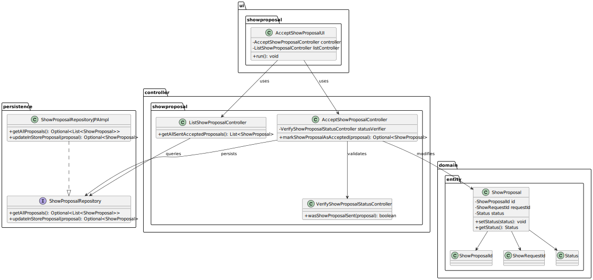
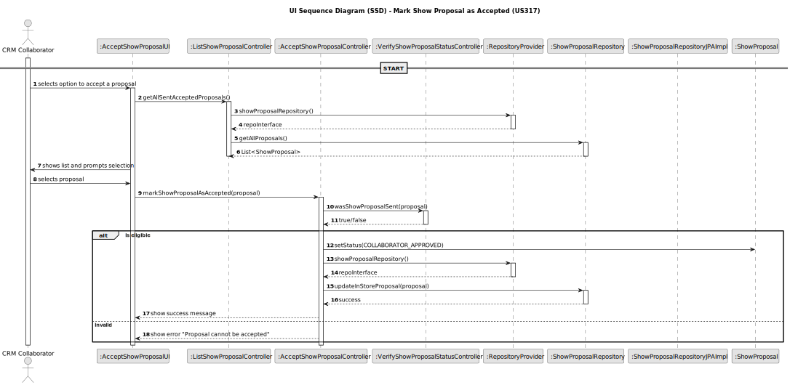

# US210 - Authentication and authorization

## 3. Design

### 3.1. Design Overview

The design for US210 implements user authentication and role-based authorization in the Shodrone back-office system. This functionality ensures that only authenticated users with valid roles can access and execute system operations according to their assigned responsibilities.
The authentication process follows these high-level steps:

1. **User Interaction**: The CRM Collaborator selects a proposal with status CUSTOMER_APPROVED via the console-based UI.

2. **Validation**: The system verifies that the selected proposal is eligible for acceptance using VerifyShowProposalStatusController.

3. **Status Update**: If valid, the system updates the proposal’s status to COLLABORATOR_APPROVED.

4. **Persistence**: The updated proposal is saved to the database via the ShowProposalRepository.

5. **Feedback**: The UI informs the user whether the operation was successful or not.

This functionality adheres to a layered architecture with clear separation of concerns:

- **UI Layer**: Handles user interaction through the AcceptShowProposalUI and provides feedback messages.

- **Application Layer**: AcceptShowProposalController acts as an orchestrator between validation, domain logic, and persistence.

- **Domain Layer**: Contains the ShowProposal aggregate and its associated value objects like ShowProposalId, Status, etc.

- **Persistence Layer**: The ShowProposalRepository interface abstracts data access.

- **Infrastructure Layer**: Not explicitly used in this feature, but role-based access is enforced globally via login constraints.

### 3.2. Sequence Diagrams

3.2.1. Class Diagram
The following class diagram models the authentication domain and infrastructure. It includes the User, UserRole, AuthenticationRepository, AuthenticationController, and supporting classes such as AuthFacade and UserSession.

3.2.2. Sequence Diagram (SD)
The following class diagram models the entities and services involved in the acceptance of a show proposal:

### 3.3. Design Patterns (if any)

Domain-Driven Design (DDD) Patterns
- Application Service
  AcceptShowProposalController serves as an application service that coordinates validation, state transitions, and persistence logic.
- Repository
  ShowProposalRepository provides an abstraction over data storage, ensuring decoupling from the data layer.
- Factory
  ShowProposal is the aggregate root representing the entire proposal entity, owning its identity, status, and business logic.
- Aggregate Root
  ShowProposalId and Status are implemented as immutable value objects that encapsulate validation and behavior of identifiers and states.