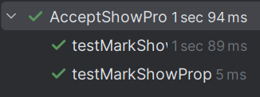
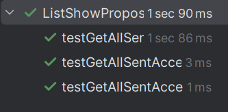

# US317 - Mark Show Proposal as Accepted

## 4. Tests

This section documents the unit tests and validation strategies used to verify the correctness of the "Mark Show Proposal as Accepted" feature.
You should include:

### **Test Cases**

1. **Unit Test: Successfully Accepting a Proposal**
   * **Description**: Verifies that a proposal in the CUSTOMER_APPROVED state can be successfully marked as COLLABORATOR_APPROVED.
   * **Scenario**: A CRM Collaborator selects an eligible proposal and accepts it.
   * **Expected Outcome**: The proposal’s status is updated to COLLABORATOR_APPROVED and persisted.
   * **Test**:
   ```java
     void testMarkShowProposalAsAccepted_Success() {
    ShowProposal proposal = new ShowProposal();
    proposal.setStatus(ShowProposalStatus.CUSTOMER_APPROVED);

    when(statusControllerMock.wasShowProposalSent(proposal)).thenReturn(true);
    when(repositoryMock.updateInStoreProposal(proposal)).thenReturn(Optional.of(proposal));

    Optional<ShowProposal> result = controller.markShowProposalAsAccepted(proposal);

    assertTrue(result.isPresent());
    assertEquals(ShowProposalStatus.COLLABORATOR_APPROVED, proposal.getStatus());
    verify(repositoryMock).updateInStoreProposal(proposal);
    }
   ```

2. **Unit Test: Fails When Proposal Is Not Eligible**
    * **Description**: Ensures that a proposal in a non-eligible state (ex: CREATED) cannot be accepted.
    * **Scenario**: A CRM Collaborator tries to accept an ineligible proposal.
    * **Expected Outcome**: The operation throws an IllegalStateException.
    * **Test**:
   ```java
     void testMarkShowProposalAsAccepted_NotEligible() {
    ShowProposal proposal = new ShowProposal();
    proposal.setStatus(ShowProposalStatus.CREATED);

    when(statusControllerMock.wasShowProposalSent(proposal)).thenReturn(false);

    IllegalStateException exception = assertThrows(IllegalStateException.class, () -> {
        controller.markShowProposalAsAccepted(proposal);
    });

    assertEquals("❌ Cannot accept the proposal because it was not sent.", exception.getMessage());
    verify(repositoryMock, never()).updateInStoreProposal(any());
    }
   ```
    
3. **Unit Test: List Eligible Proposals**
    * **Description**: Ensures that only proposals with status CUSTOMER_APPROVED are returned.
    * **Scenario**: The controller queries the list of proposals.
    * **Expected Outcome**: The list returned contains only CUSTOMER_APPROVED proposals.
    * **Test**:
   ```java
    void testGetAllSentAcceptedProposals_ReturnsEligibleProposals() {
    ShowProposal proposal1 = new ShowProposal();
    proposal1.setStatus(ShowProposalStatus.CUSTOMER_APPROVED);

    ShowProposal proposal2 = new ShowProposal();
    proposal2.setStatus(ShowProposalStatus.CUSTOMER_APPROVED);

    ShowProposal proposal3 = new ShowProposal();
    proposal3.setStatus(ShowProposalStatus.REJECTED);

    List<ShowProposal> allProposals = Arrays.asList(proposal1, proposal2, proposal3);

    when(repositoryMock.getAllProposals()).thenReturn(Optional.of(allProposals));

    List<ShowProposal> result = controller.getAllSentAcceptedProposals();

    assertEquals(2, result.size());
    assertTrue(result.stream().allMatch(p -> p.getStatus() == ShowProposalStatus.CUSTOMER_APPROVED));
    verify(repositoryMock).getAllProposals();
    }
    ```

4. **Unit Test: No Eligible Proposals**
* **Description**: Ensures that an exception is thrown when there are no eligible proposals.
* **Scenario**: The repository returns proposals, but none are eligible.
* **Expected Outcome**: An exception is thrown.
* **Test**:
   ```java
   void testGetAllSentAcceptedProposals_NoEligibleProposals_ThrowsException() {
    ShowProposal proposal1 = new ShowProposal();
    proposal1.setStatus(ShowProposalStatus.REJECTED);

    ShowProposal proposal2 = new ShowProposal();
    proposal2.setStatus(ShowProposalStatus.CREATED);

    List<ShowProposal> allProposals = Arrays.asList(proposal1, proposal2);

    when(repositoryMock.getAllProposals()).thenReturn(Optional.of(allProposals));

    RuntimeException exception = assertThrows(RuntimeException.class, () -> {
        controller.getAllSentAcceptedProposals();
    });

    assertEquals("No Show Proposal's in CUSTOMER APPROVED status were found on the system.", exception.getMessage());
    verify(repositoryMock).getAllProposals();
    }
  ```

5**Unit Test: No Proposals in Repository**
* **Description**: Ensures that an exception is thrown when the repository is empty.
* **Scenario**: The repository returns an empty Optional.
* **Expected Outcome**: An exception is thrown.
* **Test**:
   ```java
   void testGetAllSentAcceptedProposals_NoProposalsInRepo_ThrowsException() {
    when(repositoryMock.getAllProposals()).thenReturn(Optional.empty());

    RuntimeException exception = assertThrows(RuntimeException.class, () -> {
        controller.getAllSentAcceptedProposals();
    });

    assertEquals("No Show Proposal's were found on the system.", exception.getMessage());
    verify(repositoryMock).getAllProposals();
    }
  ```

### Screenshots



## 5. Construction (Implementation)

**Controller**: AcceptShowProposalController

**Controller**: ListShowProposalController
The AcceptShowProposalController and ListShowProposalController orchestrate the flow of marking a show proposal as accepted and listing eligible proposals.

**Responsibilities**:

**AcceptShowProposalController**:
- Validates if a proposal is eligible for acceptance (delegates to VerifyShowProposalStatusController).
- Updates the status of the proposal to COLLABORATOR_APPROVED.
- Persists the updated proposal via ShowProposalRepository.

**ListShowProposalController**:
- Queries all proposals from the ShowProposalRepository.
- Filters the list to only include proposals in CUSTOMER_APPROVED state.
- Returns the list to the UI layer.

**DDD Principle**:
- The controllers act as application services, orchestrating the business flow.
- The domain entity ShowProposal is the Aggregate Root, and encapsulates its status.
- VerifyShowProposalStatusController encapsulates the business rule for eligibility verification.

**Entities & Value Objects**:
* **ShowProposal (Entity)**:
- Aggregate root representing a show proposal.
- Contains the current state of the proposal (status).
- Method setStatus(...) is used to update the status.

* **ShowProposalStatus (Value Object / Enum)**:
- Represents the possible states of a show proposal:
- CREATED
- CUSTOMER_APPROVED
- REJECTED
- COLLABORATOR_APPROVED
- Used to enforce correct transitions.

**Persistence Layer**:

**ShowProposalRepository Interface**:
- Abstracts access to the persistence of show proposals.
- Method getAllProposals() used for listing proposals.
- Method updateInStoreProposal(...) used to persist updates to proposals.

**Implemented by**:
* InMemoryShowProposalRepository (for fast and isolated testing).
* ShowProposalJPAImpl (for production persistence using JPA).

**RepositoryProvider**:
* Dynamically decides which ShowProposalRepository implementation is used (InMemory vs JPA).
* Allows seamless switching between test and production environments.
* Supports injecting mock repositories for unit testing.