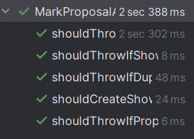

# US317 - Mark Show Proposal as Accepted

## 4. Tests

This section documents the unit tests and validation strategies used to verify the correctness of the "Mark Show Proposal as Accepted" feature.
You should include:

### **Test Cases**

1. **Successfully Accepting a Valid Proposal**
   * **Description**: A `ShowProposal` in `CUSTOMER_APPROVED` status is accepted.
   * **Expected Outcome**: The proposal’s status is updated to COLLABORATOR_APPROVED and persisted.
   * **Test**:
   ```java
     @Test
    void shouldCreateShowSuccessfully() {
        when(showRequestRepository.findById(any())).thenReturn(Optional.of(request));
        when(showRepository.findDuplicateShow(any(), any(), anyLong())).thenReturn(Optional.empty());
        when(showProposalRepository.findByID(any())).thenReturn(Optional.of(proposal));
        when(showRepository.saveInStore(any())).thenReturn(Optional.of(show));

        controller = new AcceptProposalAndCreateShowController();

        Optional<Show> createdShow = controller.acceptProposalAndCreateShow(proposal);

        assertTrue(createdShow.isPresent());
        assertEquals(ShowStatus.PLANNED, createdShow.get().getStatus());

        verify(showProposalRepository, times(1)).saveInStore(proposal);
    }
   ```

2. **Unit Test: Proposal Not Sent**
    * **Description**: Proposal is in STAND_BY or other ineligible status.
    * **Expected Outcome**: Throws IllegalStateException with proper message.
    * **Test**:
   ```java
     @Test
    void shouldThrowIfProposalNotSent() {
        when(proposal.getStatus()).thenReturn(ShowProposalStatus.STAND_BY);

        controller = new AcceptProposalAndCreateShowController();

        IllegalStateException exception = assertThrows(IllegalStateException.class, () -> {
            controller.acceptProposalAndCreateShow(proposal);
        });

        assertTrue(exception.getMessage().contains("was not sent"));
    }
   ```
    
3. **Unit Test: ShowRequest Not Found**
    * **Description**: The proposal references a ShowRequest that no longer exists.
    * **Expected Outcome**: Throws IllegalStateException.
    * **Test**:
   ```java
    @Test
    void shouldThrowIfShowRequestNotFound() {
        when(showRequestRepository.findById(any())).thenReturn(Optional.empty());

        controller = new AcceptProposalAndCreateShowController();

        IllegalStateException exception = assertThrows(IllegalStateException.class, () -> {
            controller.acceptProposalAndCreateShow(proposal);
        });

        assertTrue(exception.getMessage().contains("ShowRequest"));
    }
    ```

4. **Unit Test: Duplicate Show Already Exists**
* **Description**: A show with the same location, date and customer already exists.
* **Expected Outcome**: Throws IllegalStateException.
* **Test**:
   ```java
   @Test
    void shouldThrowIfDuplicateShowExists() {
        when(showRequestRepository.findById(any())).thenReturn(Optional.of(request));
        when(showRepository.findDuplicateShow(any(), any(), anyLong())).thenReturn(Optional.of(mock(Show.class)));

        controller = new AcceptProposalAndCreateShowController();

        IllegalStateException exception = assertThrows(IllegalStateException.class, () -> {
            controller.acceptProposalAndCreateShow(proposal);
        });

        assertTrue(exception.getMessage().contains("already exists"));
    }
  ```

5**Unit Test: Proposal No Longer in Repository**
* **Description**: The proposal is valid, but not found during persistence.
* **Expected Outcome**: Throws IllegalStateException.
* **Test**:
   ```java
   @Test
    void shouldThrowIfProposalNotInRepositoryAnymore() {
        when(showRequestRepository.findById(any())).thenReturn(Optional.of(request));
        when(showRepository.findDuplicateShow(any(), any(), anyLong())).thenReturn(Optional.empty());
        when(showProposalRepository.findByID(any())).thenReturn(Optional.empty());

        controller = new AcceptProposalAndCreateShowController();

        IllegalStateException exception = assertThrows(IllegalStateException.class, () -> {
            controller.acceptProposalAndCreateShow(proposal);
        });

        assertTrue(exception.getMessage().contains("Proposal not found"));
    }
  ```

### Screenshots



## 5. Construction (Implementation)

**Controller**: AcceptShowProposalController

**Controller**: ListShowProposalController
The AcceptShowProposalController and ListShowProposalController orchestrate the flow of marking a show proposal as accepted and listing eligible proposals.

**Responsibilities**:

**AcceptShowProposalController**:
- Validates if a proposal is eligible for acceptance (delegates to VerifyShowProposalStatusController).
- Updates the status of the proposal to COLLABORATOR_APPROVED.
- Persists the updated proposal via ShowProposalRepository.

**ListShowProposalController**:
- Queries all proposals from the ShowProposalRepository.
- Filters the list to only include proposals in CUSTOMER_APPROVED state.
- Returns the list to the UI layer.

**DDD Principle**:
- The controllers act as application services, orchestrating the business flow.
- The domain entity ShowProposal is the Aggregate Root, and encapsulates its status.
- VerifyShowProposalStatusController encapsulates the business rule for eligibility verification.

**Entities & Value Objects**:
* **ShowProposal (Entity)**:
- Aggregate root representing a show proposal.
- Contains the current state of the proposal (status).
- Method setStatus(...) is used to update the status.

* **ShowProposalStatus (Value Object / Enum)**:
- Represents the possible states of a show proposal:
- CREATED
- CUSTOMER_APPROVED
- REJECTED
- COLLABORATOR_APPROVED
- Used to enforce correct transitions.

**Persistence Layer**:

**ShowProposalRepository Interface**:
- Abstracts access to the persistence of show proposals.
- Method getAllProposals() used for listing proposals.
- Method updateInStoreProposal(...) used to persist updates to proposals.

**Implemented by**:
* InMemoryShowProposalRepository (for fast and isolated testing).
* ShowProposalJPAImpl (for production persistence using JPA).

**RepositoryProvider**:
* Dynamically decides which ShowProposalRepository implementation is used (InMemory vs JPA).
* Allows seamless switching between test and production environments.
* Supports injecting mock repositories for unit testing.