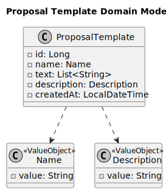

# US318 – Templates for Show Proposals

## 2. Analysis

### 2.1. Relevant Domain Model Excerpt

The following diagram illustrates the domain model for the **Proposal Template** functionality. It includes all relevant attributes and associations required for implementation, traceability, and auditing.

#### **Explanation of the Model Elements**

- **ProposalTemplate** (`<<AggregateRoot>>`):  
  The aggregate root representing a template for show proposals. It encapsulates all rules and logic necessary for managing the lifecycle of a template.

  - `id`: Primary key (surrogate, auto-generated).
  - `name`: The unique name of the template, enforced as a value object.
  - `text`: The content of the template, stored as a list of strings (lines), supporting dynamic placeholders.
  - `description`: An optional description for the template, also a value object.
  - `createdAt`: Timestamp indicating when the template was created.

- **Name** (`<<ValueObject>>`):  
  Value object representing the name of the template. Enforces constraints such as length, allowed characters, and uniqueness.

- **Description** (`<<ValueObject>>`):  
  Optional value object used to provide additional context about the template. Subject to validation constraints (length, non-empty, meaningful content).

- **Template Content**:  
  The actual content of the template, stored as a list of strings. Supports dynamic placeholders for customer and show information.

---

This detailed model supports:

- **Full auditability** of each template (when it was created).
- **Enforcement of domain constraints** (name rules, optional descriptions, template content validation).
- **Easy extensibility** for future template features or formats.
- **Complete traceability** from templates to the proposals they generate.

> This version of the domain model reflects the current implementation and ensures compliance with business rules for template management and proposal generation.

