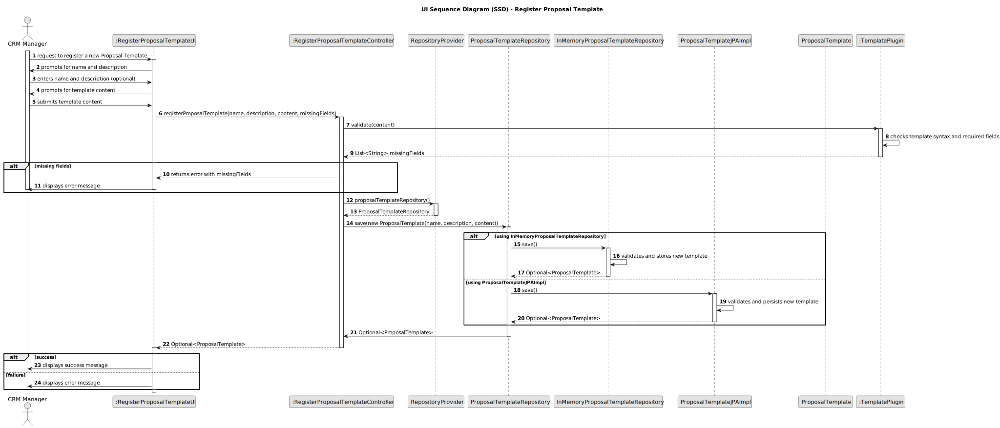

## 3. Design

### 3.1. Design Overview

The design for the **"Register Proposal Template"** functionality follows a modular, layered architecture, ensuring maintainability and extensibility in line with project requirements. The process is initiated by the **CRM Manager** through the **User Interface**, which delegates the request to a **dedicated controller**. The controller is responsible for:

- **Validating input data:** Template name, optional description, and template content syntax and completeness.
- **Validating the presence of required fields:** Uses a dedicated plugin to check the template content for required fields.
- **Creating a new `ProposalTemplate` aggregate:** Only if all business rules are satisfied.
- **Persisting the new template:** Using the repository (supports both **in-memory** and **JPA-backed** persistence).
- **Returning clear feedback:** Success or error messages are sent to the user.

This architecture enforces all **business rules**—including **auditability**, **uniqueness of template names**, and **template content validation**—at the appropriate layer. The solution is **extensible**, making it easy to support future requirements such as template versioning or additional audit data.

---

### 3.2. Sequence Diagram(s)

This sequence diagram illustrates the complete interaction flow for registering a proposal template:

- **The CRM Manager** initiates the process through the UI.
- **The UI** prompts the user for the template name, description (optional), and content.
- **The UI** collects the input and invokes the controller.
- **The controller** uses the validation plugin to check the template content for required fields and syntax.
- **If validation fails:** An error message with the missing fields is returned to the user.
- **If validation succeeds:**
  - **The controller** retrieves the repository instance from the persistence provider.
  - **Depending on the implementation used (InMemory or JPA):** The corresponding repository method is called to save the new template.
- **A success or error message** is sent to the user.

---

### 3.3. Design Patterns

- **Repository Pattern:** Abstracts access to storage, isolating the domain logic from data source logic.
- **Factory Pattern:** Used for repository creation via `RepositoryProvider`, allowing decoupled and flexible repository configuration.
- **Aggregate Root (DDD):** `ProposalTemplate` acts as the aggregate root, encapsulating consistency rules and update behavior.
- **Controller Pattern:** Centralizes business logic in the controller, separating concerns from UI and persistence layers.
- **Separation of Concerns:** Each layer (UI, Controller, Domain, Repository, Validator) has clearly defined responsibilities.
- **Plugin Pattern:** The validation logic for template content is encapsulated in a plugin, making it easy to extend or replace.
- **SOLID and GoF Principles:** The solution applies core object-oriented design principles and known design patterns for robustness and maintainability.

This design is aligned with both **functional** and **non-functional** requirements, ensuring the system remains **testable**, **scalable**, and **traceable** across future changes.