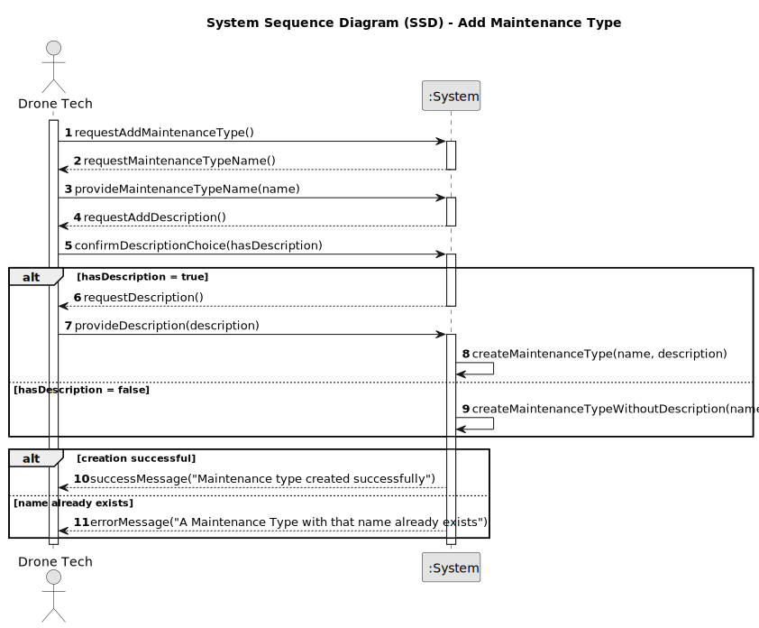

# US321 - Add Maintenance Type

## 1. Requirements Engineering

### 1.1. User Story Description

As a Drone Tech, I want to add a maintenance type to the system, so that it can be used to categorize maintenance records for drones. The system must ensure that each maintenance type has a unique name or identifier and is applicable to all drone models.

### 1.2. Customer Specifications and Clarifications

- **From Project Document (Sem4PI_Project_Requirements_v03a.pdf, Page 18)**:
  - "As a Drone Tech, I want to add a maintenance type."
  - "The maintenance types apply to all drone models."
  - Implied requirement: The maintenance type name or identifier must be unique to avoid ambiguity in maintenance records.

### 1.3. Acceptance Criteria

- [ ] The system allows a Drone Tech to create a maintenance type with a unique name or identifier.
- [ ] The system validates that the maintenance type name/identifier is unique (case-sensitive).
- [ ] Only users with the Drone Tech role can add maintenance types, as per authentication and authorization requirements (US210).
- [ ] The created maintenance type is stored persistently in the system and retrievable for use in maintenance records (US326).
- [ ] A success or error message is shown after the operation (e.g., "Maintenance type 'Battery Replacement' added successfully" or "Duplicate maintenance type name: Battery Replacement").
- [ ] The maintenance type is applicable to all drone models, requiring no specific model association.

> **Note:** These acceptance criteria will be checked off as they are addressed and implemented during the development process.

### 1.4. Found out Dependencies

- **US210 (Authentication and Authorization)**: Adding maintenance types requires authentication and role-based authorization for Drone Tech users.
- **US326 (Add Maintenance Record to a Drone)**: Maintenance types must be created before they can be associated with maintenance records.
- **US110 (Domain Model)**: The domain model must define the `MaintenanceType` entity to support this functionality.

### 1.5 Input and Output Data

**Input Data:**
- Maintenance type name or identifier (unique, case-sensitive, e.g., "Battery Replacement" or "MT-001").
- Optional: Description or additional metadata.

**Output Data:**
- Confirmation of successful addition (success message, e.g., "Maintenance type 'Battery Replacement' added successfully").
- Error message indicating reason for failure (e.g., "Duplicate maintenance type name: Battery Replacement").

### 1.6. System Sequence Diagram (SSD)

### 1.7 Other Relevant Remarks

- None