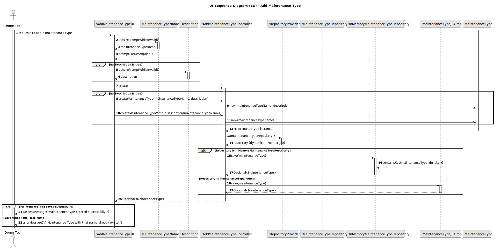

# US321 - Add Maintenance Type

## 3. Design

### 3.1. Sequence Diagram (SD)

The following sequence diagram illustrates the process of adding a maintenance type to the system, including requesting details, validating the uniqueness of the maintenance type name, and persisting the new maintenance type.

#### Key Interactions:
- **Drone Tech and UI**: The Drone Tech initiates the addition of a maintenance type via the `AddMaintenanceTypeUI`. The UI prompts for the maintenance type details (name and optional description), which the Drone Tech provides.
- **Controller and Domain**: The `AddMaintenanceTypeController` receives the details and creates `Name` and `Description` value objects, performing validation (e.g., name format). It then creates a `MaintenanceType` aggregate instance, encapsulating the validated data.
- **Controller and Repositories**: The controller uses the `RepositoryProvider` to obtain the `MaintenanceTypeRepository`, which checks for name uniqueness by querying existing maintenance types. If unique, the `MaintenanceType` is persisted using either the JPA (`MaintenanceTypeJPAImpl`) or in-memory (`MaintenanceTypeInMemory`) repository, adhering to NFR07.
- **Persistence**: The `MaintenanceType` is saved to the repository, with the system supporting both in-memory and relational database persistence (NFR07).
- **Feedback**: The UI informs the Drone Tech of the operation’s success (e.g., "Maintenance type added successfully!") or failure (e.g., "Duplicate maintenance type name!" or "Failed to save maintenance type!").
- **Error Handling**: The system validates the uniqueness of the maintenance type name (case-sensitive) and handles persistence errors, ensuring robust operation.