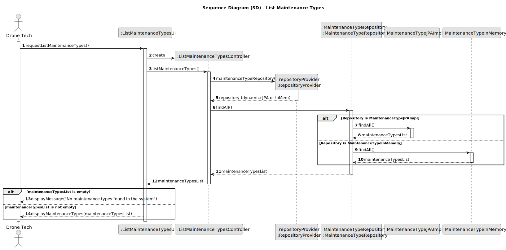

# US322 - List Maintenance Types

## 3. Design

### 3.1. Sequence Diagram (SD)

The following sequence diagram illustrates the process of listing all maintenance types in the system, including retrieving the list from persistent storage and displaying it to the Drone Tech.

#### Key Interactions:
- **Drone Tech and UI**: The Drone Tech requests the list of maintenance types via the `ListMaintenanceTypesUI`. The UI initiates the retrieval process without requiring input parameters.
- **Controller and Repositories**: The `ListMaintenanceTypesController` uses the `RepositoryProvider` to obtain the `MaintenanceTypeRepository`, which retrieves all maintenance types from persistent storage (JPA or in-memory, as per NFR07).
- **Persistence**: The `MaintenanceTypeRepository` queries the database (via `MaintenanceTypeJPAImpl`) or in-memory store (`MaintenanceTypeInMemory`) to fetch all `MaintenanceType` instances, returning a list of maintenance types with their names and optional descriptions.
- **Feedback**: The UI displays the list of maintenance types to the Drone Tech, sorted alphabetically by name. If no maintenance types exist, the UI shows an error message (e.g., "No maintenance types found in the system").
- **Error Handling**: The system handles cases where the repository is empty or inaccessible, ensuring a user-friendly response.