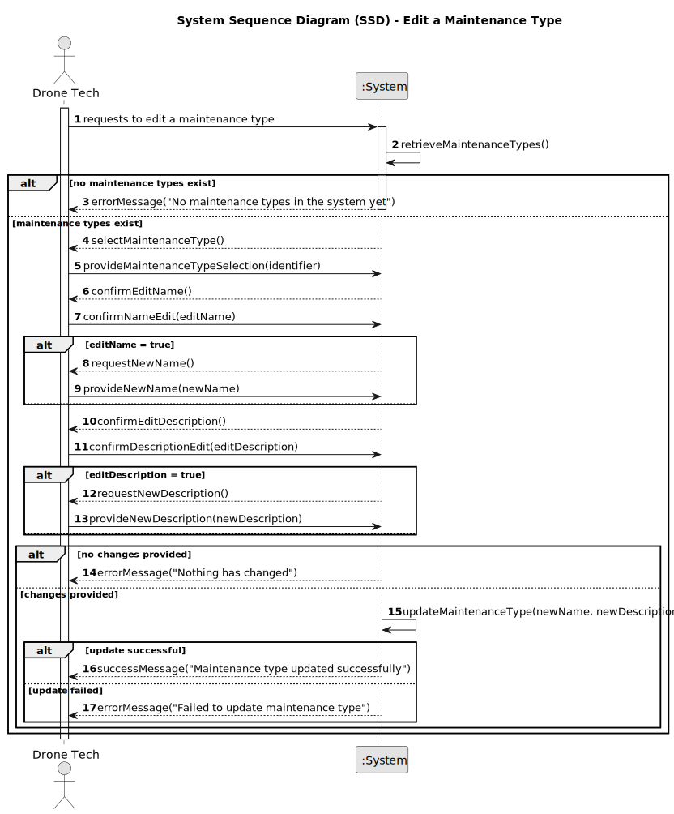

# US323 - Edit a Maintenance Type

## 1. Requirements Engineering

### 1.1. User Story Description

As a Drone Tech, I want to edit an existing maintenance type in the system, so that I can update its details to reflect changes in maintenance categorization needs. The system must allow editing of the maintenance type’s name or identifier, ensuring the updated details remain unique and are stored persistently.

### 1.2. Customer Specifications and Clarifications

- **From Project Document (Sem4PI_Project_Requirements_v03a.pdf, Page 18)**:
  - "As a Drone Tech, I want to edit a maintenance type."
  - Maintenance types apply to all drone models and are used to categorize maintenance activities.
  - Implied requirement: The edited maintenance type name or identifier must remain unique to avoid ambiguity.

- **Adaptations Due to Project Constraints**:
  - The original requirement that "only maintenance types without stored maintenance records can be edited" is not applicable, as US326 (Add Maintenance Record to a Drone) and related user stories (US325, US327, US328) are not being implemented due to the group’s size limitation (five members).
  - Therefore, any maintenance type can be edited without checking for associated maintenance records, simplifying the validation process.

### 1.3. Acceptance Criteria

- [ ] The system allows a Drone Tech to edit the name or identifier of an existing maintenance type.
- [ ] The system validates that the updated name/identifier is unique (case-sensitive).
- [ ] Only users with the Drone Tech role can edit maintenance types, as per authentication and authorization requirements (US210).
- [ ] The edited maintenance type is stored persistently in the system (relational database, as per NFR07) and retrievable for subsequent operations.
- [ ] A success or error message is shown after the operation (e.g., "Maintenance type 'Battery Replacement' updated successfully" or "Duplicate maintenance type name: Battery Replacement").
- [ ] If the maintenance type does not exist, an appropriate error message is displayed (e.g., "Maintenance type not found").

> **Note:** These acceptance criteria will be checked off as they are addressed and implemented during the development process.

### 1.4. Found out Dependencies

- **US210 (Authentication and Authorization)**: Editing maintenance types requires authentication and role-based authorization for Drone Tech users.
- **US321 (Add Maintenance Type)**: Maintenance types must be created and stored in the system before they can be edited.
- **US322 (List Maintenance Types)**: The system should allow listing maintenance types to select one for editing.
- **US110 (Domain Model)**: The domain model must define the `MaintenanceType` entity to support this functionality.

### 1.5 Input and Output Data

**Input Data:**
- Maintenance type identifier (to select the maintenance type to edit, e.g., "Battery Replacement" or "MT-001").
- Updated maintenance type name or identifier (unique, case-sensitive, e.g., "Battery Replacement V2").
- Optional: Updated description or additional metadata (to be clarified with LAPR4 RUC if required).

**Output Data:**
- Confirmation of successful update (success message, e.g., "Maintenance type 'Battery Replacement V2' updated successfully").
- Error message indicating reason for failure (e.g., "Duplicate maintenance type name: Battery Replacement V2", "Maintenance type not found").

### 1.6. System Sequence Diagram (SSD)

### 1.7 Other Relevant Remarks

- None