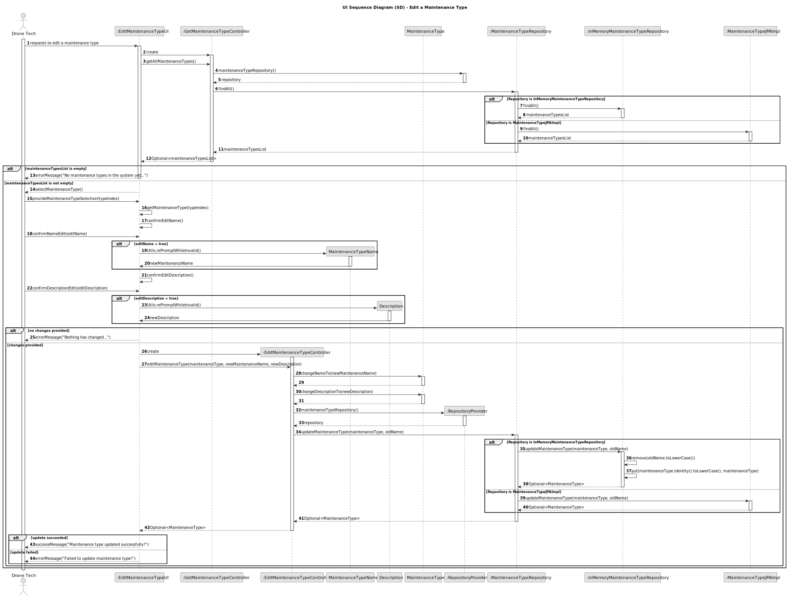

# US323 - Edit a Maintenance Type

## 3. Design

### 3.1. Sequence Diagram (SD)

The following sequence diagram illustrates the process of editing a maintenance type, including selecting a maintenance type, validating the updated name for uniqueness, and persisting the changes.

#### Key Interactions:
- **Drone Tech and UI**: The Drone Tech initiates the edit process via the `EditMaintenanceTypeUI`, selecting a maintenance type by its identifier and providing updated details (name and optional description).
- **Controller and Domain**: The `EditMaintenanceTypeController` retrieves the existing `MaintenanceType` using the `MaintenanceTypeRepository`, validates the new name for uniqueness, and updates the `MaintenanceType` aggregate with the new `Name` and `Description` value objects.
- **Controller and Repositories**: The controller uses the `RepositoryProvider` to obtain the `MaintenanceTypeRepository`, which checks for name uniqueness and persists the updated `MaintenanceType`. The repository supports both JPA (`MaintenanceTypeJPAImpl`) and in-memory (`MaintenanceTypeInMemory`) implementations, adhering to NFR07.
- **Persistence**: The updated `MaintenanceType` is saved to the repository, ensuring changes are stored in the relational database (NFR07).
- **Feedback**: The UI informs the Drone Tech of the operation’s success (e.g., "Maintenance type updated successfully!") or failure (e.g., "Duplicate maintenance type name!" or "Maintenance type not found").
- **Error Handling**: The system validates the existence of the maintenance type and the uniqueness of the new name (case-sensitive), handling errors gracefully.