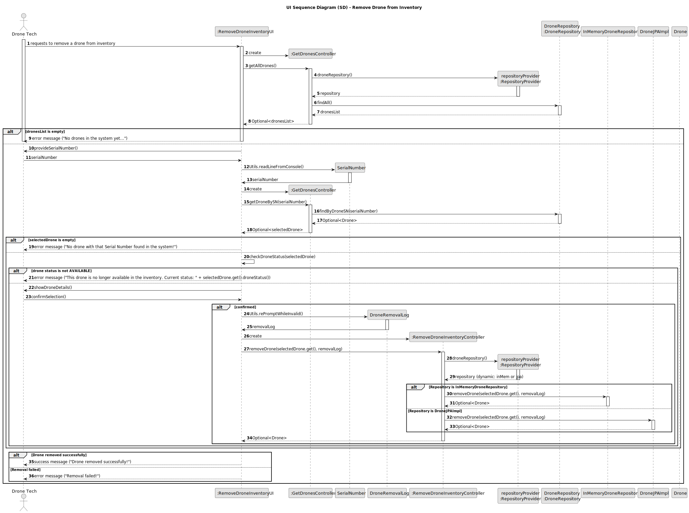

# US242 - Remove Drone from Inventory

## 3. Design

### 3.1. UI Sequence Diagram (SD)

The following sequence diagram illustrates the process of removing a drone from the inventory by creating a `DroneRemovalRecord` with the removal details.

#### Key Interactions:
- **Drone Tech and UI**: The Drone Tech initiates the removal process via the `RemoveDroneFromInventoryUI`, providing the serial number and removal reason.
- **Controller and Repositories**: The `RemoveDroneFromInventoryController` uses the `DroneRepository` to validate the serial number, and the `DroneRemovalRecordRepository` to persist the removal record.
- **Controller and Factory**: The controller uses the `DroneRemovalRecordFactoryImpl` to create a `DroneRemovalRecord` with the serial number, removal reason, removal date, and the user who performed the removal.
- **Audit Information**: The controller retrieves the `removalDate` from `LocalDateTime` and the `removedBy` user from `AuthService`.
- **Persistence**: The `DroneRemovalRecord` is persisted in both the JPA (`DroneRemovalRecordJPAImpl`) and in-memory (`InMemoryDroneRemovalRecordRepository`) repositories, adhering to NFR07.
- **Feedback**: The UI informs the Drone Tech of the operation’s success or failure, including the serial number.
