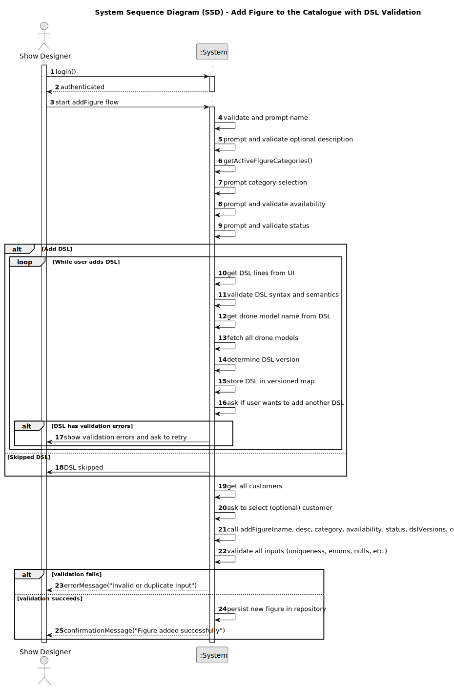

# US340 - Add Figure to the Catalogue with DSL Validation

## 1. Requirements Engineering

### 1.1. User Story Description

As a Show Designer, I want to add new figures to the catalogue with optional DSL scripts, so they can be used in drone shows by CRM Collaborators. Figures must be fully described and validated before being stored in the system.

### 1.2. Customer Specifications and Clarifications

The figure registration must follow the specifications below:

- A `Figure` includes:
  - `name` (mandatory, unique among active figures)
  - `description` (optional)
  - `category` (optional, must be active if provided)
  - `version` (mandatory, derived from DSL if present)
  - `availability` (`public` or `exclusive`)
  - `status` (automatically set to `Active`)
  - `dslVersions` (optional, can include multiple versions)
  - `exclusivityCustomerId` (optional, required if availability is `exclusive`)

**Clarifications**:
- **Q: Can a figure be added without a DSL?**  
  **A:** Yes, but DSL is recommended for automation.
- **Q: Can multiple DSL versions be added?**  
  **A:** Yes. Each DSL entry is versioned and validated individually.
- **Q: What happens if DSL is invalid?**  
  **A:** The system prompts for retry or skipping the DSL addition.
- **Q: Can availability be changed later?**  
  **A:** No. Availability is immutable after creation.

### 1.3. Acceptance Criteria

- **AC1**: Only authenticated users with the Show Designer role may access the figure creation interface.
- **AC2**: System must validate:
  - `name` is non-empty and unique among active figures
  - `version` is non-empty and valid
  - `availability` is selected
  - `category`, if present, must be valid and active
  - If `exclusive`, the selected customer must be valid
- **AC3**: DSL scripts are validated for syntax, semantics, and associated drone model name
- **AC4**: Each DSL version is stored and associated with the figure
- **AC5**: On success, a confirmation message including the new figure's ID is displayed
- **AC6**: On error (e.g., invalid input or duplicate name), a meaningful error message is shown

### 1.4. Found Out Dependencies

- **US210** – Authentication: Required to verify the user's role.
- **US220** – Customer Listing: Required for assigning exclusivity to a customer.
- **US234** – Figure Deactivation: Impacts name uniqueness constraints.
- **US245–US248** – Figure Category Management: Needed to validate and select figure category.
- **DSL Plugin Framework** – Required for validating and versioning DSL scripts.

### 1.5. Input and Output Data

#### Input Data:

- **Typed fields**:
  - `name` (string, required)
  - `description` (string, optional)
  - `version` (string, auto-extracted from DSL)
- **DSL Versions** (optional): one or more DSL scripts with validated versions
- **Selected values**:
  - `categoryId` (integer, optional)
  - `availability` (enum: `public`, `exclusive`)
  - `exclusivityCustomerId` (string, required if `exclusive`)

#### Output Data:

- **Success case**:
  - Confirmation: `"Figure added successfully with ID [Figure.id]"`
- **Failure case**:
  - Error messages explaining what failed and why (e.g., `"Name already used by an active figure"`)

### 1.6. System Sequence Diagram (SSD)

Below is a high-level representation of the interaction for DSL Plugin:

### 1.7 Other Relevant Remarks