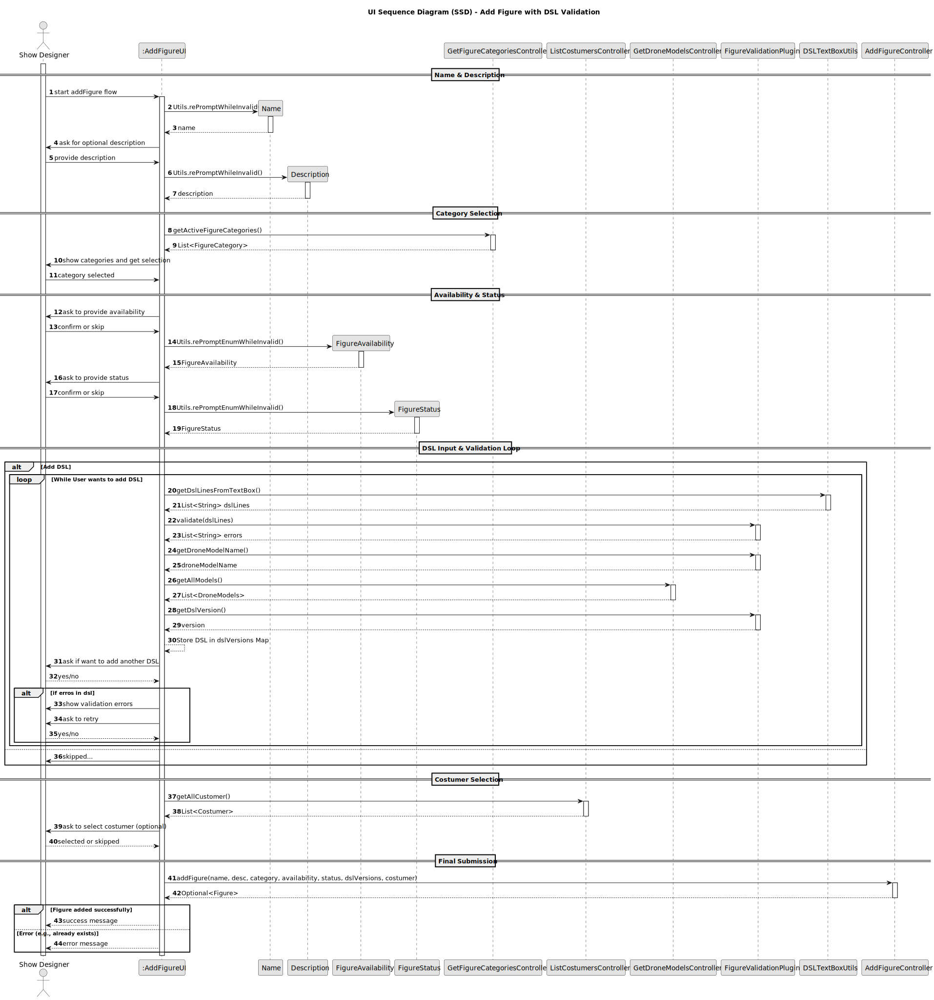

# US340 - DSL Plugin

## 3. Design

### 3.1. Design Overview

The design of the *"Add Figure to the Catalogue"* functionality follows a modular and extensible architecture that separates concerns across UI, validation, and data layers. The process is initiated by the **Show Designer**, who interacts with the UI to input and validate details for a new figure, including mandatory and optional attributes.

Key behaviors and responsibilities:
- **Role-Based Access:** Only authenticated users with the **Show Designer** role can initiate the figure addition workflow.
- **Step-by-Step Input & Validation:** The UI guides the user through entering and validating the figure’s `name`, `description`, `category`, `availability`, `status`, and at least one valid **DSL version**.
- **DSL Validation Loop:** Users can add one or more DSL entries. Each entry is validated using the `FigureValidationPlugin`. If errors are found, the user is prompted to correct or discard the entry. **At least one valid DSL is required** before proceeding.
- **Category & Customer Selection:** The user selects a figure category and may optionally associate a customer.
- **Repository Interaction:** The `AddFigureController` stores the new figure using the appropriate repository (e.g., in-memory or persistent), abstracted by the Repository Pattern.
- **Feedback Mechanism:** Upon completion, the UI provides clear feedback to the user, indicating whether the operation was successful or encountered errors.
- **Extensibility & Maintainability:** The system supports future enhancements, including additional validation plugins or UI fields, due to its modular architecture.

This design ensures both user guidance and strict validation while maintaining flexibility across layers.

---

### 3.2. Sequence Diagram

The sequence diagram illustrates the detailed flow for adding a new figure to the catalogue:

1. The **Show Designer** begins the process via the UI.
2. The UI collects and validates the `name` (required) and `description` (optional).
3. The UI fetches available figure categories and prompts for selection.
4. The user optionally provides `availability` and `status`.
5. The **DSL input loop** is initiated:
    - The user can add multiple DSLs through a textbox.
    - Each DSL is validated by the `FigureValidationPlugin`.
    - Drone model data is fetched and DSL versioning is captured.
    - Errors, if present, are displayed and the user is prompted to retry or discard.
    - The user is repeatedly asked whether to add more DSLs.
6. **Important:** If no valid DSL is stored by the end of this loop, the figure creation process is aborted and an error is shown.
7. The UI optionally prompts for customer selection.
8. The collected data is submitted to the `AddFigureController` for persistence.
9. Based on the outcome, the UI shows a success message or reports an error (e.g., duplicate figure name).

---

### 3.3. Design Patterns Used

- **Controller Pattern:** Mediates between UI input and business logic, delegating responsibilities like data aggregation and repository access.
- **Repository Pattern:** Abstracts the data persistence mechanism, supporting both in-memory and JPA implementations without impacting controller logic.
- **Factory Pattern:** Instantiates the appropriate repository implementation during runtime, improving modularity.
- **Validation Plugin Strategy:** Uses a pluggable validator (`FigureValidationPlugin`) to handle DSL verification logic, allowing new validation rules or engines to be integrated independently.
- **Separation of Concerns:** The UI, controllers, validation utilities, and data repositories are kept isolated in purpose, improving testability and maintainability.
- **SOLID Principles:** The design adheres to single-responsibility, open-closed, and dependency inversion principles to support long-term system evolution.

This implementation balances robust validation (especially for DSL input), interactive user guidance, and maintainable architecture suitable for further expansion.
