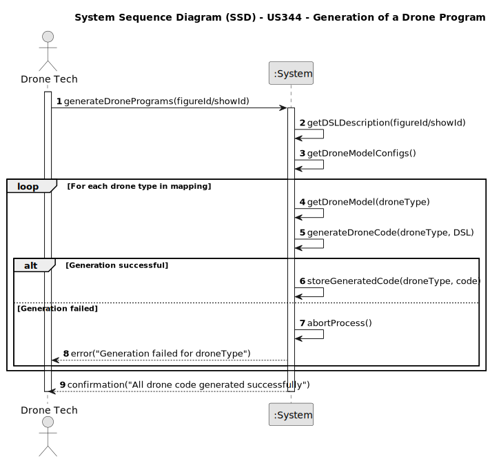

# US344 - Generation of a Drone Program

## 1. Requirements Engineering

### 1.1. User Story Description

As a Drone Tech, I want the system to use the figure/show high-level description code to generate the code of the drones to be used in the simulation/test.

### 1.2. Customer Specifications and Clarifications

- The high-level description is written in a DSL (Domain Specific Language).
- The system must translate the high-level DSL into drone-specific executable code for each drone involved in a figure/show.
- The generation of the program depends on:
-  **The drone’s model (different models may use different programming languages).**
-  **The mapping between drone types and drone models in the figure/show.**
- The generated code must be stored and associated with the figure/show and each drone involved.
- Validation of the generated code is handled in a separate user story (US346).

**Clarifications**

Q: Can different drones in the same figure use different models?
A: Yes, the same figure may map drone types to different drone models.

### 1.3. Acceptance Criteria

* AC1: Only Drone Techs can trigger code generation.
* AC2: The DSL description and drone-model must exist and be valid.
* AC3: The system must use the plugin to generate drone-specific code for each drone in the figure/show.
* AC4: If generation fails for any drone, the entire process must be aborted and an error message returned.
* AC5: Generated code must be stored and associated with the corresponding drone and figure/show.

### 1.4. Found out Dependencies

* US341 – The figure DSL must be syntactically validated before code generation.
* US345 – Plugins for each drone language must be configured and registered.
* US348 – Show-level code generation may require combining outputs from multiple figures.
* NFR11 – ANTLR-based processing and plugin use are required.
* NFR07 – Persistence of generated code is mandatory.

### 1.5 Input and Output Data

**Input Data:**

* Figure/show DSL description
* DSL version
* Drone type to model
* Drone model language configuration
* Registered plugins

**Output Data:**

* Errors if generation fails
* Success confirmation if all code is generated

### 1.6. System Sequence Diagram (SSD)

### 1.7 Other Relevant Remarks

None
