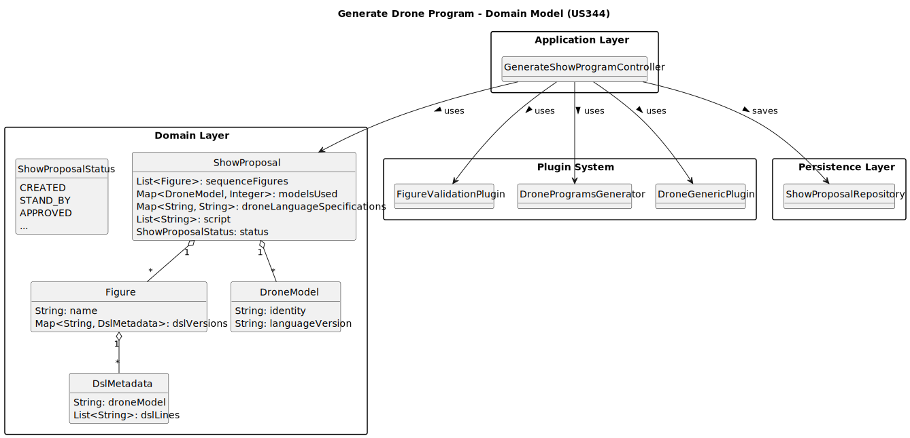

# US212 - Disable/enable users

## 2. Analysis

### 2.1. Relevant Domain Model Excerpt 

### 2.2. Other Remarks

* Access Control: Only users with the Drone Tech role are allowed to generate drone code. This must be enforced via the UI (DroneTechUI) and may later be enforced in the service layer if RBAC is centralized.
* DSL Requirements: Every Figure included in the ShowProposal must contain at least one DSL version and corresponding lines. If a figure has no DSL, generation is aborted.
* Mapping Logic: For each DroneModel in the proposal, the system must iterate over each Figure and generate specific code using a plugin based on:
- The drone model
- The DSL version and contents
- The corresponding DSL validator and code generator
* Plugin System:
- FigureValidationPlugin
- DroneGenericPlugin
* Error Handling: If any figure or generated program fails validation, the entire generation process is aborted immediately, and an error is returned. No partial results are stored.
* Data Persistence: Successfully generated code is stored in the droneLanguageSpecifications map of the ShowProposal, with a unique key based on figure name, drone model, and DSL version.
* Proposal Status Update: Upon success, the system updates the proposal’s status to STAND_BY and stores a generated movement script for simulation purposes.
* User Feedback:
- On success: a confirmation is shown.
- On failure: a clear and specific error is presented, indicating which figure and drone caused the problem.
* Scalability & Extensibility: The plugin-based architecture allows supporting new DSL versions or drone languages without changing core logic.
