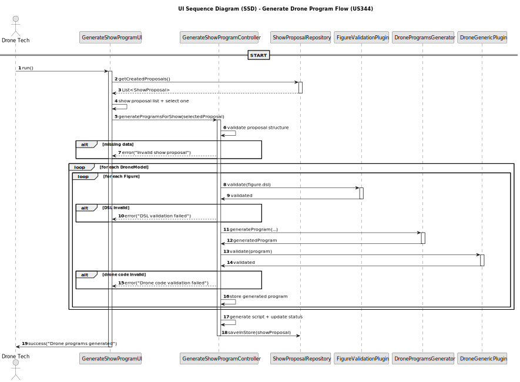

# US212 - Disable/enable users

## 3. Design

### 3.1. Design Overview

The design for US344 enables Drone Techs to trigger the generation of drone-specific code for a show proposal based on the high-level DSL description of each figure. This process transforms human-readable figure definitions into validated drone programs ready for simulation and testing.
The process follows these high-level steps:
1. **Drone Tech Input**: The Drone Tech selects a ShowProposal from a list of created proposals.
2. **Validation of Requirements**: The system ensures the proposal contains at least one figure, at least one drone model and valid DSL versions for each figure.
3. **Code Generation Loop**: The system read and calculates what need to be written.
4. **Persistence**: Upon success, the generated code is stored in the ShowProposal, a drone movement script is generated, and the status is updated to STAND_BY.

The implementation follows a layered architecture, consistent with DDD principles:
- UI Layer: Presents a menu option in DroneTechUI and triggers the GenerateShowProgramUI.
- Application Layer: GenerateShowProgramController handles all business logic — data validation, plugin coordination, and persistence.
- Domain Layer:
* ShowProposal, Figure, and DslMetadata contain the required data.
* FigureValidationPlugin and DroneGenericPlugin encapsulate validation rules.
* DroneProgramsGenerator encapsulates generation logic based on DSL and drone model.
- Persistence Layer: Interacts with ShowProposalRepository via RepositoryProvider.
- Plugin System: Supports extensibility for different DSL versions and drone programming languages.

### 3.2. Sequence Diagrams

3.2.1. Class Diagram
The following class diagram models the authentication domain and infrastructure. It includes the User, UserRole, AuthenticationRepository, AuthenticationController, and supporting classes such as AuthFacade and UserSession.

3.2.2. Sequence Diagram (SD)
The sequence diagram below illustrates the login process from user input to session creation and feedback:

### 3.3. Design Patterns (if any)

This use case applies the following Domain-Driven Design (DDD) and architectural patterns:

- Application Service
  GenerateShowProgramController coordinates all business logic.

- Repository
  ShowProposalRepository abstracts persistence logic.

- Aggregate Root
  ShowProposal is the root of the proposal and figure aggregation.

- Plugin Architecture
  FigureValidationPlugin and DroneGenericPlugin allow DSL and language validation to be extensible and configurable.

- Value Object
  DslMetadata acts as a value object containing DSL-related data.
