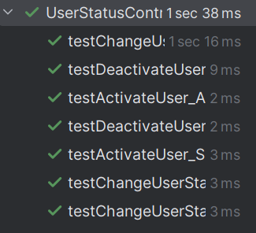

# US212 - Disable/enable users

## 4. Tests

This section documents the unit tests and validation strategies used to verify the correctness of the user status management functionality, ensuring that only valid operations (admin-initiated and consistent with domain rules) are permitted and persisted correctly.

### **Test Cases**

1. **Unit Test: User Is Active**
   * **Description**: Verifies that the controller correctly detects an active user.
   * **Expected Outcome**: `isUserActive(user)` returns `true`.
   * **Test**:
    ```java
    @Test
    void testUserIsActiveReturnsTrue() {
        User mockUser = mock(User.class);
        when(mockUser.isActive()).thenReturn(true);

        boolean result = controller.isUserActive(mockUser);

        assertTrue(result, "Expected user to be active");
    }
    ```

2. **Unit Test: User Is Inactive**
   * **Description**: Verifies that the controller correctly detects an inactive user.
   * **Expected Outcome**: `isUserActive(user)` returns `false`.
   * **Test**:
    ```java
    @Test
    void testUserIsInactiveReturnsFalse() {
        User mockUser = mock(User.class);
        when(mockUser.isActive()).thenReturn(false);

        boolean result = controller.isUserActive(mockUser);

        assertFalse(result, "Expected user to be inactive");
    }
    ```

3. **Unit Test: Filter Only Active Users**
   * **Description**: Ensures only non-admin active users are returned.
   * **Expected Outcome**: The result list includes only active users who are not administrators.
   * **Test**:
    ```java
    @Test
    void testFilterOnlyActiveUsers() {
        User activeUser = mock(User.class);
        when(activeUser.isActive()).thenReturn(true);
        when(activeUser.hasRole(AuthenticationController.ROLE_ADMIN)).thenReturn(false);

        User inactiveUser = mock(User.class);
        when(inactiveUser.isActive()).thenReturn(false);
        when(inactiveUser.hasRole(AuthenticationController.ROLE_ADMIN)).thenReturn(false);

        when(mockListController.getAllUsers()).thenReturn(List.of(activeUser, inactiveUser));

        List<User> result = controller.getUsersByFilter(0);
        assertEquals(1, result.size());
        assertTrue(result.contains(activeUser));
    }
    ```

4. **Unit Test: Filter Only Inactive Users**
   * **Description**: Ensures only non-admin inactive users are returned.
   * **Expected Outcome**: The result list includes only inactive users who are not administrators.
   * **Test**:
    ```java
    @Test
    void testFilterOnlyInactiveUsers() {
        User activeUser = mock(User.class);
        when(activeUser.isActive()).thenReturn(true);
        when(activeUser.hasRole(AuthenticationController.ROLE_ADMIN)).thenReturn(false);

        User inactiveUser = mock(User.class);
        when(inactiveUser.isActive()).thenReturn(false);
        when(inactiveUser.hasRole(AuthenticationController.ROLE_ADMIN)).thenReturn(false);

        when(mockListController.getAllUsers()).thenReturn(List.of(activeUser, inactiveUser));

        List<User> result = controller.getUsersByFilter(1);
        assertEquals(1, result.size());
        assertTrue(result.contains(inactiveUser));
    }
    ```

5. **Unit Test: Filter All Users Except Admins**
   * **Description**: Ensures the returned user list excludes admin users.
   * **Expected Outcome**: Admin users are not present in the result list.
   * **Test**:
    ```java
    @Test
    void testFilterAllUsersExceptAdmins() {
        User normalUser = mock(User.class);
        when(normalUser.isActive()).thenReturn(true);
        when(normalUser.hasRole(AuthenticationController.ROLE_ADMIN)).thenReturn(false);

        User adminUser = mock(User.class);
        when(adminUser.hasRole(AuthenticationController.ROLE_ADMIN)).thenReturn(true);

        when(mockListController.getAllUsers()).thenReturn(List.of(normalUser, adminUser));

        List<User> result = controller.getUsersByFilter(99);
        assertEquals(1, result.size());
        assertTrue(result.contains(normalUser));
        assertFalse(result.contains(adminUser));
    }
    ```

6. **Unit Test: Get All Users with Status Format**
   * **Description**: Verifies that the list includes correct ACTIVE/INACTIVE formatting.
   * **Expected Outcome**: The list includes user info with their current status.
   * **Test**:
    ```java
    @Test
    void testGetAllUsersWithStatusShowsCorrectFormat() {
        User user1 = mock(User.class);
        when(user1.getId()).thenReturn(new Email("john@shodrone.app"));
        when(user1.getName()).thenReturn("John");
        when(user1.isActive()).thenReturn(true);

        User user2 = mock(User.class);
        when(user2.getId()).thenReturn(new Email("jane@shodrone.app"));
        when(user2.getName()).thenReturn("Jane");
        when(user2.isActive()).thenReturn(false);

        when(mockUserRepo.findAll()).thenReturn(List.of(user1, user2));

        List<String> result = controller.getAllUsersWithStatus();

        assertEquals(2, result.size());
        assertTrue(result.get(0).contains("ACTIVE") || result.get(1).contains("ACTIVE"));
        assertTrue(result.get(0).contains("INACTIVE") || result.get(1).contains("INACTIVE"));
    }
    ```

7. **Unit Test: Get All Users When None Exist**
   * **Description**: Verifies that an empty list is returned when there are no users.
   * **Expected Outcome**: An empty list is returned without errors.
   * **Test**:
    ```java
    @Test
    void testGetAllUsersWithStatusWhenNoUsersExist() {
        when(mockUserRepo.findAll()).thenReturn(List.of());

        List<String> result = controller.getAllUsersWithStatus();

        assertTrue(result.isEmpty());
    }
    ```

8. **Unit Test: Activate User**
   * **Description**: Ensures an inactive user can be activated and persisted.
   * **Expected Outcome**: User becomes active; changes are saved and reflected in memory.
   * **Test**:
    ```java
    @Test
    void testActivateUser_Success() {
        when(mockUser.isActive()).thenReturn(false);

        boolean result = controller.activateUser(mockUser);

        assertTrue(result);
        verify(mockUser).activate();
        verify(mockUserRepository).save(mockUser);
        verify(mockAuthRepo).setUserActive(anyString(), eq(true));
    }
    ```

9. **Unit Test: Activate Already Active User**
   * **Description**: Ensures no update occurs if user is already active.
   * **Expected Outcome**: `false` is returned; nothing is persisted.
   * **Test**:
    ```java
    @Test
    void testActivateUser_AlreadyActive() {
        when(mockUser.isActive()).thenReturn(true);

        boolean result = controller.activateUser(mockUser);

        assertFalse(result);
        verify(mockUser, never()).activate();
        verify(mockUserRepository, never()).save(mockUser);
    }
    ```

10. **Unit Test: Deactivate User**
   * **Description**: Ensures an active user can be deactivated and persisted.
   * **Expected Outcome**: User becomes inactive; changes are saved and reflected in memory.
   * **Test**:
    ```java
    @Test
    void testDeactivateUser_Success() {
        when(mockUser.isActive()).thenReturn(true);

        boolean result = controller.deactivateUser(mockUser);

        assertTrue(result);
        verify(mockUser).deactivate();
        verify(mockUserRepository).save(mockUser);
        verify(mockAuthRepo).setUserActive(anyString(), eq(false));
    }
    ```

11. **Unit Test: Deactivate Already Inactive User**
   * **Description**: Ensures no update occurs if user is already inactive.
   * **Expected Outcome**: `false` is returned; nothing is persisted.
   * **Test**:
    ```java
    @Test
    void testDeactivateUser_AlreadyInactive() {
        when(mockUser.isActive()).thenReturn(false);

        boolean result = controller.deactivateUser(mockUser);

        assertFalse(result);
        verify(mockUser, never()).deactivate();
        verify(mockUserRepository, never()).save(mockUser);
    }
    ```

12. **Unit Test: Change Status to Active**
   * **Description**: Confirms that `changeUserStatus` activates and persists a user.
   * **Expected Outcome**: `true` is returned; state and repositories are updated.
   * **Test**:
    ```java
    @Test
    void testChangeUserStatus_ToActive() {
        when(mockUser.isActive()).thenReturn(false);

        boolean result = controller.changeUserStatus(mockUser, true);

        assertTrue(result);
        verify(mockUser).activate();
        verify(mockUserRepository).save(mockUser);
        verify(mockAuthRepo).setUserActive(anyString(), eq(true));
    }
    ```

13. **Unit Test: Change Status to Inactive**
   * **Description**: Confirms that `changeUserStatus` deactivates and persists a user.
   * **Expected Outcome**: `true` is returned; state and repositories are updated.
   * **Test**:
    ```java
    @Test
    void testChangeUserStatus_ToInactive() {
        when(mockUser.isActive()).thenReturn(true);

        boolean result = controller.changeUserStatus(mockUser, false);

        assertTrue(result);
        verify(mockUser).deactivate();
        verify(mockUserRepository).save(mockUser);
        verify(mockAuthRepo).setUserActive(anyString(), eq(false));
    }
    ```

14. **Unit Test: Change Status with No Change**
   * **Description**: Ensures `changeUserStatus` does nothing if status is unchanged.
   * **Expected Outcome**: `false` is returned; no operations are executed.
   * **Test**:
    ```java
    @Test
    void testChangeUserStatus_NoChange() {
        when(mockUser.isActive()).thenReturn(true);

        boolean result = controller.changeUserStatus(mockUser, true);

        assertFalse(result);
        verify(mockUser, never()).activate();
        verify(mockUserRepository, never()).save(mockUser);
    }
    ```

### Screenshot




## 5. Construction (Implementation)

**Controller**: ManageUserController
The ManageUserController handles status toggling operations (enable/disable), interfacing between UI requests and domain rule enforcement.

**Responsibilities**
- Fetches user from list and changes the active flag.
- Delegates persistence to UserRepository.
- Provides helper methods to check user status (isUserActive).

**DDD Principles**
- Business rules such as "a user must be active to login" and "only Admins may disable users" are enforced at the application and domain levels.
- The User aggregate encapsulates activate() and deactivate() methods.
- The controller serves as an Application Service, coordinating the workflow without implementing business logic directly.

**Persistence Layer**
- UserRepository: Handles retrieval and storage of user aggregates with updated status.
- AuthenticationRepository: Used to verify or synchronize roles and login permissions.
