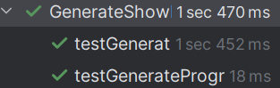

# US344 - Generation of a Drone Program

## 4. Tests

This section documents the unit testing strategies for validating drone program generation logic based on DSL descriptions, ensuring proper validation, program creation, and repository persistence.

### **Test Cases**

1. **Unit Test:  Successful Drone Program Generation**
   * **Description**: Ensure that a well-formed DSL input correctly produces drone code and a script.
   * **Expected Outcome**: A ShowProposal with drone programs and a non-empty script.
   * **Test**:
    ```java
    @Test
    void testGenerateProgramsForShow_Success() {
        when(mockRepo.saveInStore(any())).thenReturn(Optional.of(proposal));

        Optional<ShowProposal> result = controller.generateProgramsForShow(proposal);

        assertTrue(result.isPresent(), "Expected proposal to be saved successfully");
        assertNotNull(result.get().getDroneLanguageSpecifications(), "Expected generated language specifications");
        assertFalse(result.get().getDroneLanguageSpecifications().isEmpty(), "Expected at least one program generated");

        assertNotNull(result.get().getScript(), "Expected script to be generated");
        assertFalse(result.get().getScript().isEmpty(), "Expected script not to be empty");
        assertTrue(result.get().getScript().get(0).matches("\\[\\d+]"), "Script should start with number of drones");
    }
    ```

2. **Unit Test: Invalid DSL - Program Should Not Be Generated**
   * **Description**: Confirm that invalid DSL input prevents code generation.
   * **Expected Outcome**: No program is generated, but a script may still be built.
   * **Test**:
    ```java
    @Test
    void testGenerateProgramsForShow_InvalidDSL_ShouldAbort() {
        List<String> badDsl = List.of("DSL version 1.1.2;", "INVALID LINE HERE;");
        when(figure.dslVersions()).thenReturn(Map.of("1.1.2", new DslMetadata("Mini4Pro", badDsl)));

        when(mockRepo.saveInStore(any())).thenReturn(Optional.of(proposal));

        Optional<ShowProposal> result = controller.generateProgramsForShow(proposal);

        assertTrue(result.isEmpty(), "Expected generation to fail and return empty result");
    }

    ```

### Screenshot



## 5. Construction (Implementation)

**Controller**: GenerateShowProgramController
This controller is responsible for orchestrating the generation of drone programs based on the DSL descriptions defined in a ShowProposal.

**Responsibilities**
- Iterates through the figures and drone types defined in the given show proposal.
- Generates a flight script that coordinates all drones.
- Persists the updated proposal (with generated code and script) using ShowProposalRepository.

**DDD Principles**
- **Application Service**: The GenerateShowProgramController serves as the orchestrator for the use case, coordinating workflow without implementing domain logic directly.
- **Entity**: ShowProposal acts as the aggregate root, encapsulating all related data, including figures and drone configurations.
- **Value Object**: DSL definitions and DroneModelID are treated as immutable value objects.
- **Fail-fast logic**: In line with business requirements, the system immediately halts program generation if any figure or DSL fails to produce valid output.
- 
**Persistence Layer**
- ShowProposalRepository: Provides access to proposal persistence operations.
- The actual storage mechanism may vary (e.g., JPA, in-memory repository, or file-based), and is abstracted behind this interface.