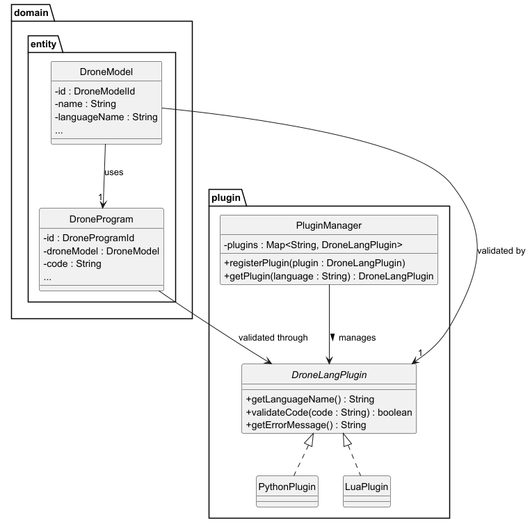

# US345 - Drone Language Plugin

## 2. Analysis

### 2.1. Relevant Domain Model Excerpt

> The diagram includes the following key concepts:
>
> * `DroneModel`: the entity that specifies the supported programming language.
> * `DroneProgram`: the code to be validated for a specific drone.
> * `DroneLangPlugin`: a pluggable component used to validate the code based on the associated language.
> * `PluginRegistry` (or `PluginManager`): a service/component that manages plugin registration and lookup.

---

### 2.2. Other Remarks

#### **Implementation Considerations**

* The system uses the **EAPLI framework** and will follow **domain-driven design patterns**. Although `DroneLangPlugin` is not a persistent domain entity, it behaves like a service registered at runtime.
* A `PluginManager` class (singleton or service) will act as a registry that maps language names to their corresponding plugin implementations.
* The `DroneModel` entity includes a `languageName` attribute that must match a registered plugin.
* When a drone program is about to be validated, the system will:

  1. Retrieve the `DroneModel` associated with the drone.
  2. Look up the plugin from the `PluginManager` using the model’s language.
  3. Use the plugin to validate the drone code before proceeding with simulation or deployment.
* The plugin interface should follow a common contract (`DroneLangPlugin`) with methods like `boolean validateCode(String code)`, `String getLanguageName()`, and `String getErrorMessage()`.

#### **Business Rule Enforcement**

* The drone program must be validated **before** any simulation or test is run.
* If no plugin exists for a drone's language, the system must **prevent the operation** and show an appropriate error.
* The validation logic **must not modify** the code — it should strictly perform syntax and structure analysis.
* A plugin must only be accepted if it **implements the required interface** and is associated with a unique, valid language name.

#### **Potential Risks and Mitigations**

* **Plugin Interface Breaking Changes**: If the plugin interface changes, all existing plugins may become invalid.

  * *Mitigation*: Use a stable interface with strong contract enforcement and versioning if needed.
* **Missing Plugin for a Language**: A drone may reference a programming language without a registered plugin.

  * *Mitigation*: At registration of a drone model or during validation, verify that a matching plugin exists.
* **Security/Injection Risk**: Since plugins are executable code, dynamic loading could pose a security risk.

  * *Mitigation*: Restrict loading to approved, compiled plugin classes within the trusted codebase (no dynamic file-based plugin loading in Sprint 2).
* **Runtime Errors in Plugin**: A poorly implemented plugin may throw exceptions or crash validation.

  * *Mitigation*: Use defensive coding, error handling, and extensive unit testing for plugin implementations.

#### **Future Considerations**

* Add a **plugin management interface** where admins or Drone Techs can enable/disable or test plugins (future US).
* Extend plugins to support **semantic validation** or **performance analysis** (e.g., resource limits).
* Support for **external plugin JAR loading** can be explored in a future iteration if needed.
* Allow plugins to provide **language-specific code hints** or formatting rules.

#### **Alignment with Non-Functional Requirements**

* **NFR02 (Documentation)**: This analysis document and the class diagram (`us345-domain-model.svg`) are versioned in the GitHub repository.
* **NFR03 (Test-Driven Development)**: Unit tests must be written for each plugin implementation (e.g., `PythonPlugin`, `LuaPlugin`) as well as for the `PluginManager` logic. Tests will cover valid/invalid code and edge cases like missing plugins.
* **NFR04 (Version Control)**: All plugin source files and test code will be committed to GitHub, referencing the user story issue (e.g., `#145`).
* **NFR07 (In-Memory and RDBMS Support)**: The `DroneModel` and `DroneProgram` entities are persisted and compatible with both in-memory and relational modes. Plugins themselves are runtime objects and not persisted.
* **NFR08 (Authentication and Role-Based Access)**: Only authenticated Drone Techs will be authorized to register plugins or validate code, enforced via EAPLI’s `AuthFacade`.