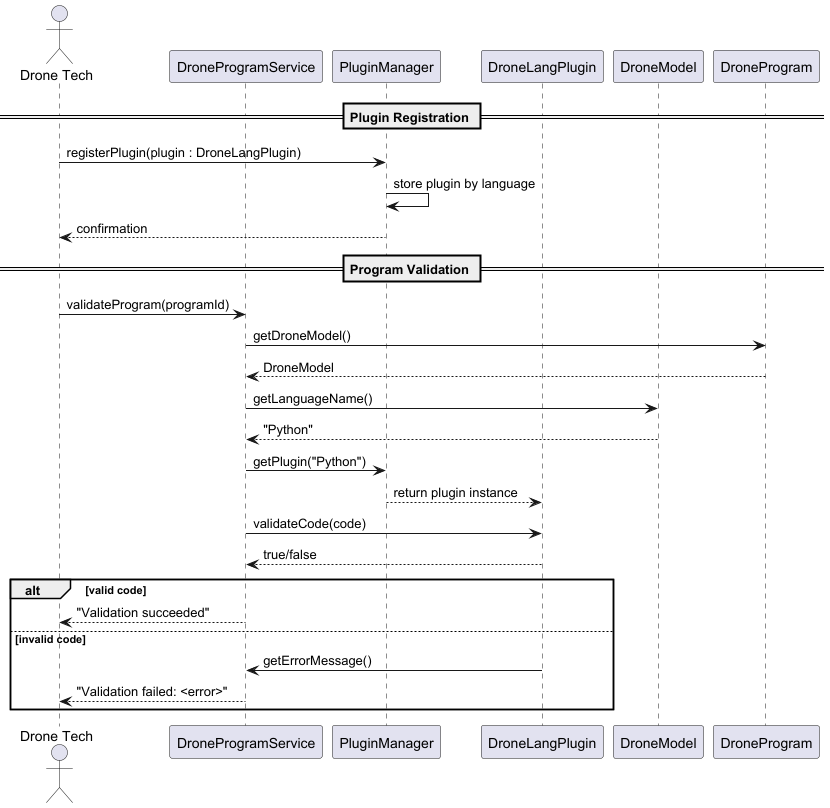

# US345 - Drone Language Plugin

## 3. Design

### 3.1. Design Overview

The design for US345 focuses on enabling the registration, configuration, and use of language-specific plugins that validate drone programs before simulation or execution. This feature is critical to ensure that each drone’s source code complies with the syntactic rules of its associated programming language. The system must be extensible to support multiple drone languages, each validated by a separate plugin.

The design follows the layered architecture defined in the EAPLI framework (NFR07), and includes the following main responsibilities:

1. **Authentication and Authorization**: The Drone Tech logs into the system. The system checks their credentials and permissions to ensure they are authorized to manage drone language plugins (via US210 and NFR08).
2. **Plugin Registration**: The Drone Tech registers a new plugin implementation through an internal API or configuration. The system verifies the plugin and associates it with a unique language name.
3. **Validation Execution**: Whenever a drone program is generated or uploaded, the system retrieves the plugin corresponding to the drone’s language and runs the validation.
4. **Error Handling**: If the plugin fails to validate the code or is missing, the system aborts the operation and displays a meaningful error message.
5. **Feedback**: The result of the plugin validation is returned to the user or calling process, including error messages if applicable.

The design is structured across the following layers:

* **UI Layer**: May include command-line feedback or logs (minimal for plugin registration, more involved during validation).
* **Application Layer**: Hosts the service logic for plugin management and validation coordination.
* **Domain Layer**: Includes `DroneModel`, `DroneProgram`, and the `DroneLangPlugin` interface.
* **Infrastructure Layer**: Includes the `PluginManager`, responsible for managing and resolving plugin instances at runtime.

---

### 3.2. Sequence Diagrams

#### 3.2.1. Class Diagram

> The diagram defines:
>
> * `DroneModel`: stores the language name.
> * `DroneProgram`: stores the actual code.
> * `DroneLangPlugin`: interface for plugins.
> * `PluginManager`: maintains a registry of language-to-plugin mappings.
> * `PythonPlugin`, `LuaPlugin`: implementations of `DroneLangPlugin`.

#### 3.2.2. Sequence Diagram (SD)

The Sequence Diagram below illustrates how the system uses the `PluginManager` to retrieve and invoke the correct plugin based on the drone model’s language when validating a `DroneProgram`.

---

### 3.3. Design Patterns

The implementation of US345 uses several well-established design patterns, many of which align with the EAPLI framework and domain-driven design principles:

#### **Strategy Pattern**

* The `DroneLangPlugin` interface acts as a strategy interface.
* Each language plugin (e.g., `PythonPlugin`, `LuaPlugin`) is a concrete strategy.
* The system dynamically selects the appropriate plugin strategy at runtime using the drone’s language name.

#### **Service Locator (PluginManager)**

* The `PluginManager` acts as a service locator that maintains a mapping between programming language identifiers and plugin implementations.
* This decouples the consumers (e.g., `DroneProgramValidator`) from the concrete plugin classes.

#### **Application Service Pattern**

* The validation logic can be encapsulated in an application service such as `ValidateDroneProgramService`.
* This service coordinates the retrieval of the drone model and program, plugin resolution, and execution of the validation process.

#### **Factory Pattern (Optional Future Use)**

* A factory could be used to dynamically load and instantiate plugins from classpath or external JARs in a future enhancement.

#### **Adapter Pattern (for third-party validators)**

* If external tools (e.g., ANTLR or language-specific linters) are used inside a plugin, the plugin may act as an adapter to translate between internal drone program representations and external tools.

---

### Explanation of the Design Section

#### 3.1. Design Overview

* Introduces the goal of supporting language-specific validation of drone programs.
* Describes how authentication, registration, and validation flows are handled.
* Emphasizes the extensibility and flexibility of the plugin-based architecture.

#### 3.2. Diagrams

* The **Class Diagram** shows the relationships between `DroneModel`, `DroneProgram`, the plugin interface, and its implementations.
* The **Sequence Diagram** shows:

  * A Drone Tech or internal process initiating validation.
  * The system retrieving the correct plugin based on the language.
  * The plugin performing validation and returning results.

#### 3.3. Design Patterns

* **Strategy** is used for runtime selection of validation logic.
* **Service Locator (PluginManager)** manages plugin registration and retrieval.
* **Application Service** encapsulates the validation coordination.
* Optional future use of **Factory** and **Adapter** is discussed to further modularize or extend plugin integration.