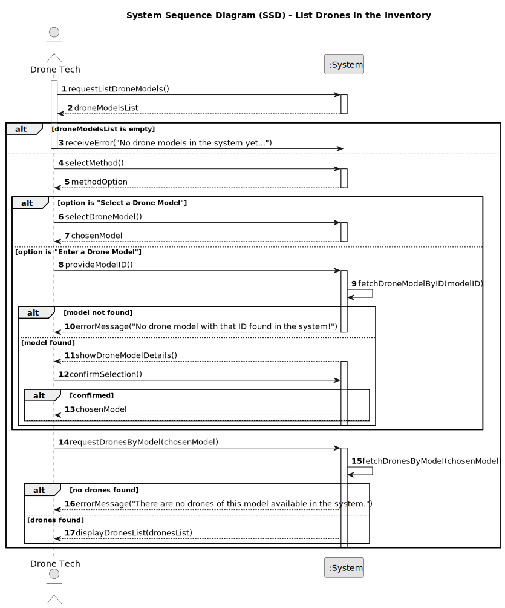

# US243 - List Drones in the Inventory

## 1. Requirements Engineering

### 1.1. User Story Description

As a Drone Tech, I want to list active drones of a given model in the inventory, so that I can manage and select them for simulations and shows. The list should include only drones with a status of “available” and be associated with a specific `DroneModel` chosen by the Drone Tech.

### 1.2. Customer Specifications and Clarifications

- **From Project Document (Sem4PI_Project_Requirements_v02b.pdf, Page 15, Line 34-35)**:
    - "As a Drone Tech, I want to list active drones of a given model in the inventory."

- **Additional Specifications**:
    - The system must allow the Drone Tech to select a `DroneModel` (e.g., "DJI Phantom X") from a list of existing models created via US240.
    - The list should include only drones with a status of “available” indicating they are active and available in the inventory.
    - The list should display each drone’s serial number for identification.
    - The results should be sorted alphabetically by serial number for ease of use.
    - Only authenticated users with the Drone Tech role can request the list.
    - The system must provide clear feedback if no active drones are found for the selected model.

### 1.3. Acceptance Criteria

- [ ] The system allows a Drone Tech to request a list of active drones for a selected `DroneModel`.
- [ ] The system validates that the selected `DroneModel` exists and is from a list of existing models.
- [ ] The system filters the list to include only drones with a status of "stored."
- [ ] The system sorts the list of drones alphabetically by serial number.
- [ ] The list displays each drone’s serial number.
- [ ] Only users with the Drone Tech role can request the list.
- [ ] A list of drones or an appropriate message (e.g., "No active drones found for this model") is shown after the operation.

> **Note:** These acceptance criteria will be checked off as they are addressed and implemented during the development process.

### 1.4. Found out Dependencies

- **US240 (Drone Model Creation)**: The `DroneModel` must exist in the system before its drones can be listed, as the list is model-specific.
- **US241 (Add Drone to Inventory)**: The ability to list drones depends on them being added to the inventory with a status of "stored."
- **US242 (Remove Drone from Inventory)**: The list should exclude drones that have a `DroneRemovalRecord`, ensuring only active (non-removed) drones are shown.
- **US210 (Authentication and Authorization)**: Listing drones requires authentication and role-based authorization for Drone Tech users.

### 1.5 Input and Output Data

**Input Data:**
- Selected drone model identifier (chosen from a list of existing `DroneModel` types, e.g., "DJI Phantom X").

**Output Data:**
- List of active drones (each with a serial number, e.g., ["SN-001", "SN-002"]) for the selected `DroneModel`, sorted alphabetically by serial number.
- Message indicating no active drones found (e.g., "No active drones found for this model") if applicable.

### 1.6. System Sequence Diagram (SSD)

  

### 1.7 Other Relevant Remarks

- None.