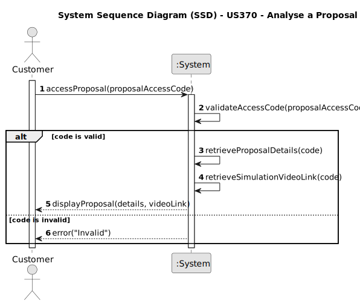

# US370 - Analyse a Proposal

## 1. Requirements Engineering

### 1.1. User Story Description

As a Customer, I want to have access to a show proposal of mine. I received a link/code.

### 1.2. Customer Specifications and Clarifications

- The customer must be able to access a specific proposal using a link or a unique code previously shared.

**Clarifications**

### 1.3. Acceptance Criteria

* AC1: A customer can access a proposal using a valid link or code.
* AC2: The system must display the proposal content in a readable and structured format.
* AC3: The page must be read-only — no actions like acceptance or editing are allowed here.

### 1.4. Found out Dependencies

* US316 – The proposal must have been previously sent and made available to the customer.
* US315 – If available, the simulation video should be shown.
* US371 – The customer may proceed to accept or reject the proposal afterward.
* NFR07 – Proposal data and sharing links must be persisted.
* NFR08 – Proposal access must enforce secure code validation.

### 1.5 Input and Output Data

**Input Data:**

* Proposal access code

**Output Data:**

* Proposal details

### 1.6. System Sequence Diagram (SSD)

### 1.7 Other Relevant Remarks

None
