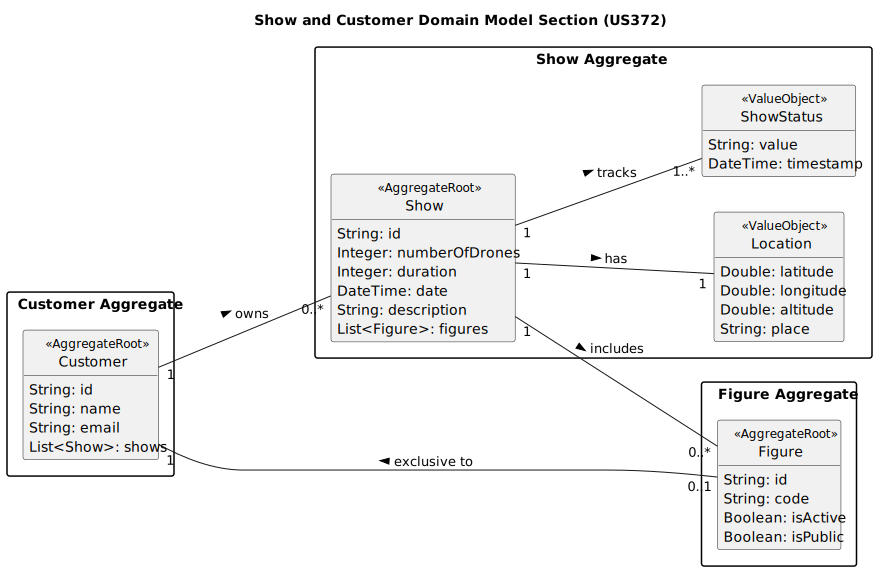

# US372 - List Scheduled Shows

## 2. Analysis

### 2.1. Relevant Domain Model Excerpt

The relevant domain model for US372 includes the entities and relationships involved in listing scheduled shows for a customer. Below is the PlantUML representation of the domain model excerpt for this user story.

### 2.2. Other Remarks

- **Implementation Considerations**:
    - The domain model should include a relationship between `Customer` and `Show` to enable retrieval of all shows associated with a specific customer. The `shows` list in `Customer` facilitates efficient filtering by customer ID.
    - The `Show` entity should contain attributes such as `id`, `customer`, `numberOfDrones`, `duration`, `date`, `location`, `description`, `status`, and `figures` to provide the required details for listing.
    - The `ShowStatus` entity tracks the state of each show (e.g., "Pending", "Scheduled", "Completed"), with a `timestamp` to record status changes, which can be useful for auditing or future filtering.
    - The `Location` value object encapsulates geographical data (latitude, longitude, altitude, and place), ensuring consistency in location representation.

- **Business Rule Enforcement**:
    - The system must enforce that only shows with statuses other than "Cancelled" are included in the list, which can be handled by a query filter in the `ShowRepository`.
    - The list should be sorted by the `date` attribute in ascending order, which can be implemented in the application layer or repository query.

- **Future Considerations**:
    - The UI could be enhanced to allow filtering by status (e.g., only "Scheduled" shows), which might require extending the domain model or adding a query parameter in a future iteration.
    - A feature to export the list (e.g., to PDF or CSV) could be added in a future user story to improve customer usability.
    - The system might benefit from pagination support if a customer has a large number of shows, which could be addressed by modifying the repository to return paginated results.

- **Alignment with Non-Functional Requirements**:
    - **NFR02 (Documentation)**: The domain model (`us372-domain-model-List_Scheduled_Shows_Domain_Model.svg`) and this analysis document are part of the required documentation, stored in the repository.
    - **NFR03 (Test-Driven Development)**: Unit tests should be written for the `ShowRepository` to verify filtering by customer and status, as well as sorting by date. Integration tests should ensure the UI correctly displays the list.
    - **NFR08 (Role-Based Access)**: The system must ensure that only authenticated customers can access their own shows, enforced via EAPLI’s authentication module (US210).
    - **NFR07 (Database by Configuration)**: The `ShowRepository` should support both in-memory and RDBMS modes, with indexing on `customer` and `date` to optimize query performance.