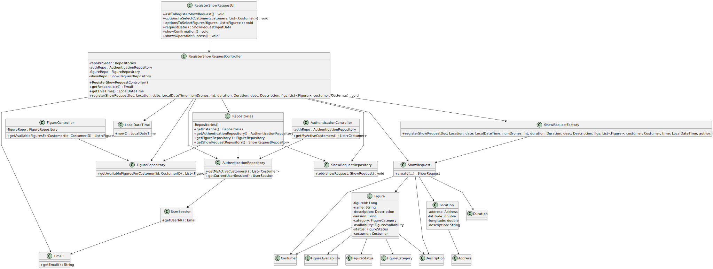

# US372 - List Scheduled Shows

## 3. Design

### 3.1. Design Overview

The design for US372 focuses on implementing the functionality to list scheduled shows associated with an authenticated Customer within the Shodrone system, adhering to the EAPLI framework (NFR07). The process involves the following high-level steps:

1. **Authentication and Authorization**: The Customer logs into the system, and their role is verified (via US210, NFR08: role-based access).
2. **User Interaction**: The Customer interacts with a console-based UI (provided by EAPLI) to view a list of their scheduled shows.
3. **Data Retrieval**: An application service (`ListScheduledShowsService`) retrieves all show requests associated with the authenticated Customer, excluding those with a "Cancelled" status, and sorts them by date.
4. **Presentation**: The system formats the retrieved data and displays it in the UI, including details such as ID, date, duration, location, and status.
5. **Feedback**: If no shows are found, the system displays a message: "No scheduled shows found for your account."

The design follows a layered architecture:
- **UI Layer**: Handles user interaction via EAPLI’s console UI (`ListScheduledShowsUI`).
- **Application Layer**: Contains the `ListScheduledShowsService`, which coordinates the use case logic.
- **Domain Layer**: Includes entities (`Customer`, `Show`, `Location`, `ShowStatus`, `Figure`) and enforces business rules (e.g., excluding "Cancelled" status).
- **Persistence Layer**: Uses EAPLI’s repository pattern (`ShowRepository`) for data access.
- **Infrastructure Layer**: Leverages EAPLI’s authentication (`AuthFacade`) and persistence mechanisms.

### 3.2. Sequence Diagrams

#### 3.2.1. Class Diagram

#### 3.2.2. Sequence Diagram (SD)
The Sequence Diagram (SD) below provides a detailed view of the internal interactions within the system to list scheduled shows. It includes the UI, application service, domain entities, repositories, and authentication components.

### 3.3. Design Patterns (if any)

The design for US372 leverages several design patterns, primarily those provided by the EAPLI framework and common in domain-driven design (DDD):

- **Application Service Pattern**:
  - The `ListScheduledShowsService` acts as an application service, orchestrating the use case logic. It coordinates interactions between the UI, domain entities, and repositories, handling tasks like retrieving shows, filtering by status, and sorting by date.

- **Repository Pattern**:
  - The `ShowRepository` is used to abstract persistence logic, supporting both in-memory and RDBMS modes (NFR07). This pattern decouples the domain layer from the persistence layer, allowing flexible data access (e.g., `findByCustomer` method with filtering and sorting).

- **Decorator Pattern (for Formatting)**:
  - The `ListScheduledShowsService` applies a lightweight Decorator-like approach to format the retrieved show data for display. It "decorates" the raw `Show` data by combining attributes (e.g., `date`, `duration`, `location.place`, and `status.value`) into a user-friendly string before passing it to the UI.

- **Strategy Pattern (Potential Future Use)**:
  - While not implemented in US372, the system could use the Strategy pattern for future enhancements, such as supporting different sorting or filtering strategies (e.g., by status or location). This would involve defining a `ListStrategy` interface with implementations like `DateSortStrategy`.

### Explanation of the Design Section

#### 3.1. Design Overview
- Provides a high-level view of the design, outlining the steps involved in listing scheduled shows:
  - Authentication ensures role-based access (NFR08).
  - The UI allows the Customer to view their scheduled shows.
  - The `ListScheduledShowsService` retrieves and sorts the shows, excluding "Cancelled" ones.
  - The UI displays the formatted list or a no-shows message.
- Describes the layered architecture (UI, Application, Domain, Persistence, Infrastructure), aligning with EAPLI’s structure and ensuring separation of concerns.

#### 3.2. Sequence Diagrams
- **SSD**: Reuses the SSD from the Requirements Engineering phase (Section 1.6), providing a high-level view of the interaction between the Customer and the system.
- **SD**: The detailed Sequence Diagram (`us372-sequence-diagram.svg`) shows internal interactions:
  - The `ListScheduledShowsUI` handles user interaction, using EAPLI’s console UI.
  - The `ListScheduledShowsService` orchestrates the use case, retrieving shows from the `ShowRepository` with appropriate filters and sorting.
  - The `ShowRepository` handles data access.
  - Entities (`Customer`, `Show`, `Location`, `ShowStatus`, `Figure`) are queried.
  - The `AuthFacade` (from US210) ensures role-based access.
  - The diagram includes an alternative flow for the case where no shows are found.

#### 3.3. Design Patterns
- Identifies patterns used in the design:
  - **Application Service**: `ListScheduledShowsService` coordinates the use case, a standard pattern in DDD and EAPLI.
  - **Repository**: Used for persistence, aligning with EAPLI’s approach (NFR07).
  - **Decorator**: Used for formatting the output in the application service.
  - **Strategy**: Suggested for future sorting or filtering enhancements, but not implemented in US372.

### Additional Information
- **Validation Logic**: The design ensures that only shows associated with the authenticated Customer and with statuses other than "Cancelled" are retrieved, enforced in the `ShowRepository` query.
- **Performance Optimization**: The `ShowRepository` should use indexing on `customer` and `date` to optimize the sorted query, especially for large datasets.
- **Reusability**: The design reuses the `AuthFacade` from US210 for authentication and could leverage pagination logic from future UI enhancements.
