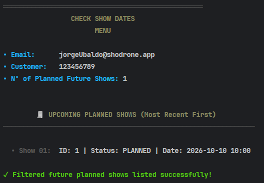

# US372 - Check Show Dates

## 4. Tests

This section documents **unit tests**, **integration tests**, and **validation procedures** for the feature that allows customers to check their scheduled show requests.

### Test Cases

1. **Unit Test: Filter Cancelled Shows**

    * **Description**: Ensures that only non-cancelled shows are returned.
    * **Scenario**: A customer has three show requests, one of which is cancelled.
    * **Expected Outcome**: Only the two active shows are returned.

2. **Unit Test: Sort Shows by Date**

    * **Description**: Validates that shows are returned in ascending order by date.
    * **Scenario**: The customer has shows scheduled on different dates.
    * **Expected Outcome**: Shows are returned from the earliest to the latest date.

3. **Integration Test: End-to-End Customer Show Listing**

    * **Description**: Tests the full flow from inputting a customer’s NIF to receiving the list of scheduled shows.
    * **Scenario**: A representative accesses the customer app and checks the scheduled shows for a client using their NIF.
    * **Expected Outcome**: The system returns the correct list of `ShowDTO` objects with expected details.

4. **Edge Case: No Shows Found**

    * **Description**: Validates behavior when the customer has no scheduled shows.
    * **Scenario**: The customer has no active show requests.
    * **Expected Outcome**: An empty list or a user-friendly message is shown.

5. **Edge Case: Invalid NIF**

    * **Description**: Handles invalid or unauthorized NIF input.
    * **Scenario**: The representative inputs a NIF not associated with any client they manage.
    * **Expected Outcome**: The system throws an exception or displays an appropriate error message.

#
#
#

---

## 5. Construction (Implementation)

This section describes the logic behind the implementation of the scheduled show listing functionality.

* **Controller**: `CheckShowDatesController`

    * Receives the customer's NIF from the UI.
    * Validates the relationship between the authenticated representative and the client.
    * Returns filtered and sorted `ShowDTO` objects.

* **UI**: `CheckShowDatesUI`

    * Prompts the user to enter the customer's NIF.
    * Displays the list of scheduled shows (excluding cancelled ones), sorted by date.

* **Service**: `ShowRequestService`

    * Applies filtering logic (excludes cancelled shows) and sorting.
    * May validate the NIF or client-representative association.

* **Repository**: `ShowRequestRepository`

    * Provides methods like `findAllScheduledByCustomerNif(String nif)` to retrieve active show requests.

* **DTO**: `ShowDTO`

    * Includes fields such as `id`, `date`, `duration`, `location`, and `state`.

* **Implementation Strategy**:

    * The UI collects the customer's NIF.
    * The controller validates access and delegates to the service.
    * The service fetches the data, applies filters and sorting, and returns the results as DTOs.
    * The UI displays the results in a clean format.

* **Patterns Used**:

    * **DTO Pattern**: Used to expose data without exposing the domain model.
    * **Service Layer Pattern**: To isolate business logic from UI and persistence.
    * **Repository Pattern**: Abstracts database access.
    * **Decorator Pattern** (optional): Can be used to enrich `ShowDTO` objects.

---

## 6. Integration and Demo

### Integration Points

* **Authentication**: Uses the authenticated representative’s credentials to validate access to the customer’s data.
* **Persistence**: Show requests are stored in the database and accessed via `ShowRequestRepository`.
* **Client-Server Communication**: Utilizes TCP sockets and JSON serialization (via `ObjectDTO` and Gson).

### Demo Walkthrough

1. User selects "Check Show Dates" in the client app.
2. The system prompts for the customer's NIF.
3. The system validates that the customer is managed by the authenticated representative.
4. The system retrieves active (non-cancelled) show requests and sorts them by date.
5. The list of shows is displayed with details for each entry.

---

## 7. Observations

* **Known Limitations**:

    * Only non-cancelled shows are displayed.
    * If the NIF is not linked to a client of the representative, an error is returned.
    * The list is read-only; no further actions can be taken on the shows.

* **Design Decisions**:

    * `ShowDTO` is used to decouple internal domain models from presentation.
    * Filtering by state is handled at the service layer for flexibility.
    * Shows are sorted by date for better user experience.

* **Open Questions**:

    * Should we allow exporting the list (e.g., PDF or CSV)?
    * Should more details (e.g., number of drones, responsible collaborator) be shown?
    * Should the client be notified when a representative checks their show data?

