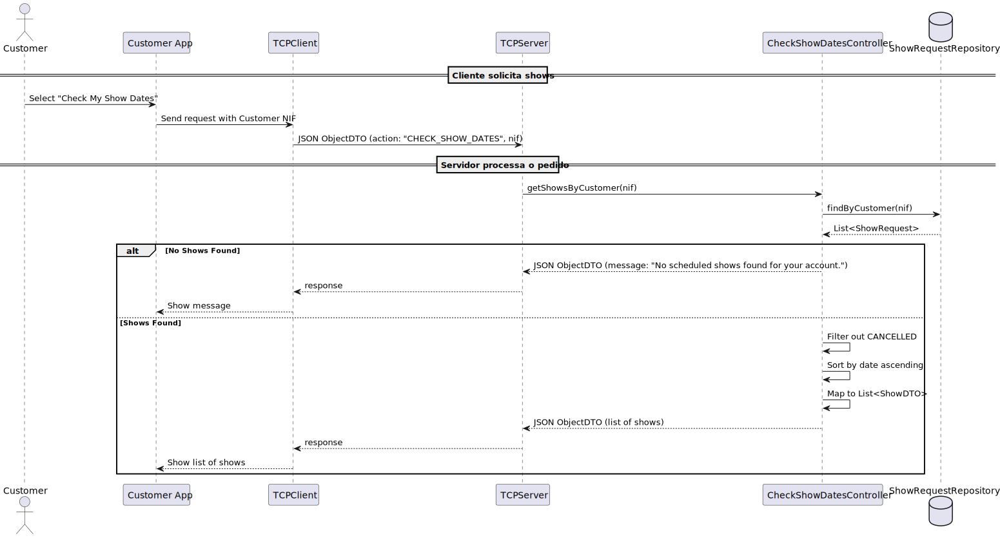

# US372 - Check Shows Dates

## 1. Requirements Engineering

### 1.1. User Story Description

As a Customer, I want to list my scheduled shows, so that I can review the details of upcoming events I have requested. This allows me to stay informed about the status and scheduling of my show requests.

### 1.2. Customer Specifications and Clarifications

- **From Project Requirements (Sem4PI_Project_Requirements_v03a.pdf, Section 3.1.2, Page 9)**:
  - "Customers (corporate or public entities) can view their show requests, including details such as date, duration, location, and status."
  - "The system must provide a read-only view for customers to monitor their requests."
- **Clarifications from Customer Forum**:
  - None.

### 1.3. Acceptance Criteria

- **AC1**: A Customer must be authenticated to list their scheduled shows.
- **AC2**: The system must display a list of all show requests associated with the authenticated customer, excluding those with a status of "Cancelled."
- **AC3**: The list must include the following details for each show request: ID, date, duration, location, and status.
- **AC4**: The list must be sorted by date in ascending order (earliest first).
- **AC5**: The operation must be read-only and not allow modifications to the show requests.
- **AC6**: If no show requests are found for the customer, the system must display a message: "No scheduled shows found for your account."

### 1.4. Found out Dependencies

- **US230 - Register Show Request**: This user story depends on US230 because show requests must be created before they can be listed.
- **US210 - Authentication and User Management**: The user story relies on authentication to identify the customer and retrieve their show requests.

### 1.5. Input and Output Data

**Input Data:**
- None

**Output Data:**

- List of show requests (e.g., "SR-001: 2025-06-15 20:00, 30 mins, Lisbon Central Park, Pending").
- Message if no requests: "No scheduled shows found for your account."

### 1.6. System Sequence Diagram (SSD)

Below is the PlantUML source code for the System Sequence Diagram (SSD) of US372, showing the interaction between the Customer, the system, and external entities.

### 1.7. Other Relevant Remarks

- The UI should present the list in a paginated format if the number of show requests is large, improving usability.
- The system should allow the customer to click on a show request ID to view additional details (e.g., figures or description), which could be implemented in a future user story.
- Performance considerations: The query should be optimized by indexing show requests by customer ID and status to handle large datasets efficiently.

