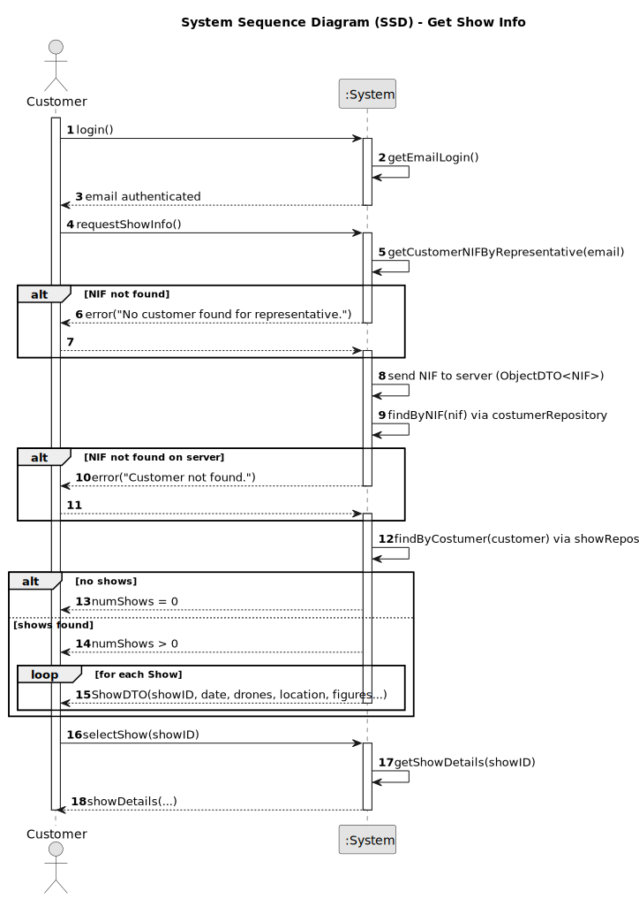

# US373 - Get Show Info X

## 1. Requirements Engineering

### 1.1. User Story Description

As a Show Manager, I want to retrieve detailed information about a specific show so that I can review its status, schedule, and associated resources to manage it effectively.

### 1.2. Customer Specifications and Clarifications

The following specifications are derived from the requirements document and domain model:

- The system must return comprehensive show details including:
  - Show ID, name, description, and status
  - Scheduled date and time
  - Assigned figures and designers
  - Current progress and any pending tasks
- The operation must be efficient and return results promptly.
- Only authorized users (Show Managers and above) can access show information.
- The information should be current and reflect the latest state of the show.
- If the show does not exist or is inaccessible, a relevant error message should be returned.

**Clarifications**:
- **Q: What level of detail is expected in the show info?**
  - A: Detailed enough for management decisions, including linked figures and assigned personnel.
- **Q: Can users other than Show Managers view this info?**
  - A: No, access is restricted for confidentiality.
- **Q: Should historical shows be retrievable?**
  - A: Yes, both active and archived shows must be accessible.

**Forum Questions**:
> **Question:** Como é que a informação do show é atualizada e sincronizada no sistema?
>
> **Answer:** A informação é atualizada em tempo real sempre que alterações são feitas por designers ou gestores do show.

### 1.3. Acceptance Criteria

- **AC1**: Only authenticated Show Managers and authorized roles can retrieve show info.
- **AC2**: The system returns complete and up-to-date show details.
- **AC3**: The system responds within an acceptable time frame (e.g., < 2 seconds).
- **AC4**: If the show ID is invalid or inaccessible, an appropriate error message is shown.

### 1.4. Found out Dependencies

- **US120**: Authentication and authorization – To verify user roles and permissions.
- **US220**: Show scheduling – To retrieve accurate timing information.
- **US340**: Show progress tracking – To provide up-to-date progress details.
- **US300**: Figure management – To list figures assigned to the show.

### 1.5 Input and Output Data

**Input Data:**

- Typed data:
  - `Show.id` (string, Required)

**Output Data:**

- Success: JSON or structured data containing:
  - `Show.id`
  - `Show.name`
  - `Show.description`
  - `Show.status`
  - `Show.scheduledDateTime`
  - `Show.assignedFigures` (list)
  - `Show.assignedDesigners` (list)
  - `Show.progress`
- Error: Relevant error message (e.g., "Show not found." or "Access denied.")

### 1.6 System Sequence Diagram (SSD)

Below is the PlantUML source code for the System Sequence Diagram (SSD) of US373, showing the interaction between the Show Manager, the system, and backend services:

### 1.7 Other Relevant Remarks

- Ensure caching strategies do not return stale show data.
- Consider logging access for audit purposes.
- Possible future extension: allow filtered retrieval by date or status.
