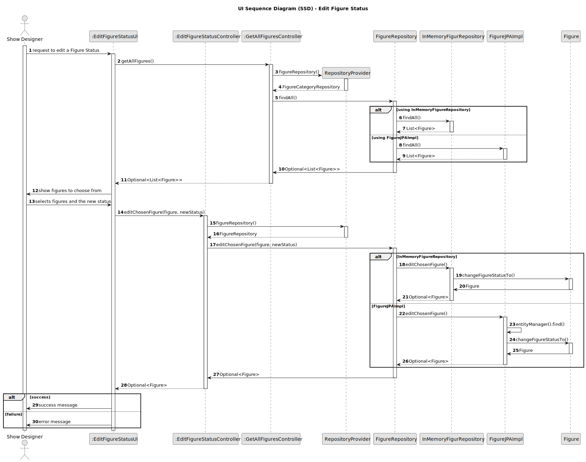

## 3. Design

### 3.1. Design Overview

The design for the **"Decommission Figure"** functionality follows the same modular and layered architecture as the rest of the system, supporting both maintainability and extensibility. This functionality allows a **Show Designer** to change the status of a figure (typically marking it as decommissioned) through the UI, which then delegates the request to a dedicated controller.

The flow is as follows:
- The **Show Designer** initiates the status update process via the UI.
- The UI invokes a controller to retrieve all existing figures.
- The retrieved figures are presented to the user for selection.
- Upon user selection, the UI passes the chosen figure and the new status to the controller.
- The controller fetches the repository instance via a provider (either **InMemory** or **JPA** based).
- The figure is retrieved and its status is updated accordingly (e.g., to "decommissioned").
- The updated entity is saved, and success or failure feedback is returned to the UI.

This design ensures that all **business rules and data integrity constraints** are enforced by the domain and controller layers. It is designed for flexibility in data storage and future-proofing (e.g., supporting soft-deletion or audit logging enhancements).

---

### 3.2. Sequence Diagram(s)

This sequence diagram outlines the process for decommissioning a figure:

1. The **Show Designer** initiates a request to change a figure’s status via the UI.
2. The UI requests all available figures by invoking `GetAllFiguresController`.
3. The controller obtains the appropriate `FigureRepository` using the `RepositoryProvider`.
4. Depending on the storage implementation, figures are fetched either from the **InMemory** or **JPA** repository.
5. A list of figures is returned and displayed to the user.
6. The **Show Designer** selects the `figure` to decommission and the desired new `status`.
7. The UI sends the selected figure and new status to the `EditFigureStatusController`.
8. The controller again resolves the repository and calls the appropriate method to update the figure status.
9. The figure entity updates its own status internally and is persisted back via the repository.
10. The updated figure is returned, and the UI provides success or failure feedback to the user.

---

### 3.3. Design Patterns

- **Repository Pattern:** Decouples domain logic from data persistence, allowing figures to be managed consistently across different storage backends.
- **Factory Pattern:** Used to instantiate the correct repository through `RepositoryProvider`, supporting modular configuration and testability.
- **Aggregate Root (DDD):** The `Figure` acts as an aggregate root, enforcing its own consistency and encapsulating status-changing behavior.
- **Controller Pattern:** Business logic for editing figure status resides in the controller, separating responsibilities between UI and domain layers.
- **Separation of Concerns:** Clear delineation exists between the UI (presentation), controller (application logic), entity (domain), and repository (persistence).
- **SOLID and GoF Principles:** The design follows SOLID principles, ensuring robustness, testability, and adherence to good object-oriented practices.

This approach ensures traceability, reliability, and modularity for handling figure status updates, aligning with both functional and non-functional system requirements.
