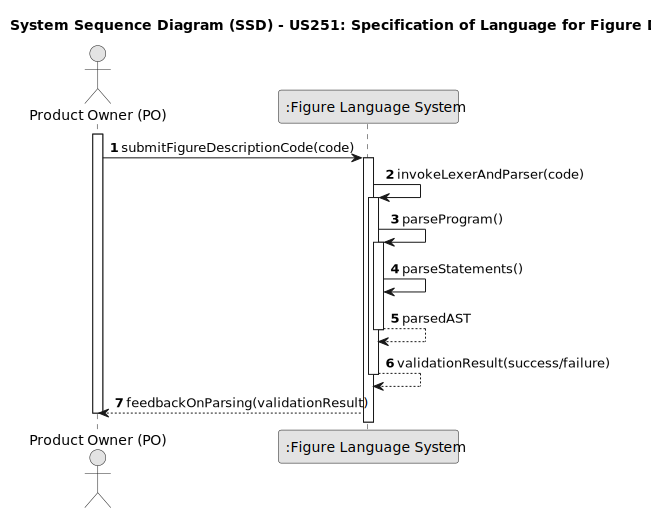

# US253 – Configuration of a Drone’s Language

## 1. Requirements Engineering

### 1.1. User Story Description

**As a Drone Tech**, I want to specify in the system the **ANTLR grammar (DSL)** for a given **drone model**, so that the system can parse an `input.txt` file containing instructions for that drone. This ensures that each drone model is tied to a well-defined language and input files are correctly interpreted and validated.

---

### 1.2. Customer Specifications and Clarifications

This user story involves the creation and configuration of a **domain-specific language (DSL)** using ANTLR4 for drone programming.

- The **DSL is represented as an ANTLR grammar file** (e.g., `DroneOne.g4`).
- The grammar defines:
  - A **start rule** (`program`) for parsing
  - Lexical and syntactic rules for:
    - Variable declarations (`Position`, `Vector`, etc.)
    - Instructions
    - Mathematical expressions
- A **drone model** must be linked to **one DSL grammar**.
- The system must use this grammar to **parse a text input file** (e.g., `input.txt`) with the goal of validating it.

**Clarifications:**

- **Q: Can a DroneModel have more than one grammar?**  
  **A:** No. One grammar per drone model.

- **Q: How is the grammar tested?**  
  **A:** It is compiled via ANTLR and used to parse a sample `input.txt`.

- **Q: What happens if the grammar fails?**  
  **A:** The system will report parsing or compilation errors.

- **Q: Is grammar updating allowed?**  
  **A:** Yes, future updates can upload new versions.

---

### 1.3. Acceptance Criteria

- **AC1**: Only Drone Techs (authorized users) can assign a grammar to a drone model.
- **AC2**: The system must compile the grammar (e.g., `DroneOne.g4`) using ANTLR.
- **AC3**: The system must parse an `input.txt` file using the generated parser to confirm grammar correctness.
- **AC4**: If the grammar is invalid or the input does not match the grammar, a meaningful error is returned.
- **AC5**: A valid grammar and input file must produce a parse tree or pass validation without errors.

---

### 1.4. Found out Dependencies

- **US210**: User authentication and role-based access control.
- **ANTLR tooling**: Requires integration with `antlr-4.13.1-complete.jar`.
- **Java/JUnit environment**: For compiling and testing the grammar and its parser.
- **Makefile setup**: Automates grammar compilation and test execution.

---

### 1.5. Input and Output Data

**Input Data:**

**FIle: `input.txt`**

**Output Data:**

- Success or error confirmation
- Diagnostic messages if the grammar is invalid
- DSL metadata for verification and debugging

---

### 1.6. System Sequence Diagram (SSD)

Below is the PlantUML source code for the System Sequence Diagram (SSD) of US253, showing the interaction between the Drone Tech, the system, and internal components responsible for language validation and association.

---

### 1.7 Other Relevant Remarks
