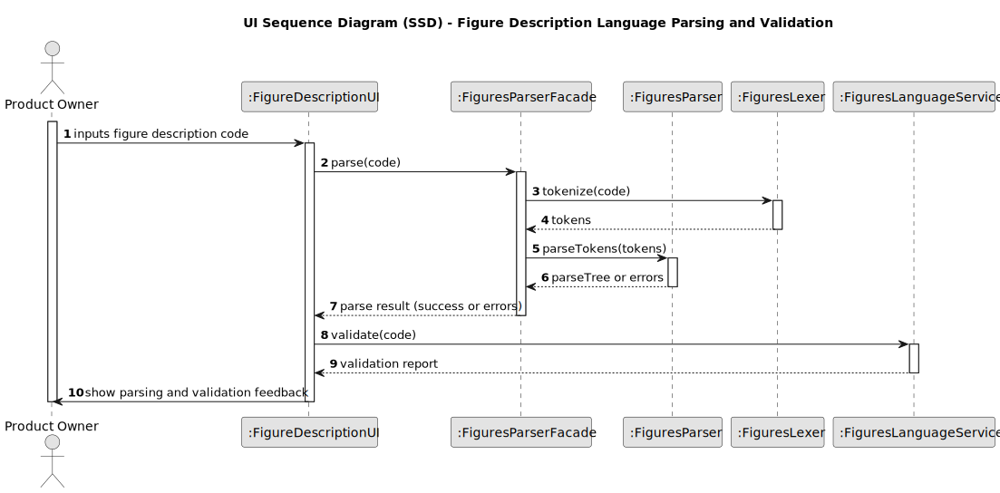

# US251 – Specification of the Language for Figure and Show Description Using ANTLR Grammar

## 3. Design

### 3.1. Design Overview

O design para a especificação da linguagem de descrição de figuras e shows por meio de uma gramática ANTLR segue princípios arquiteturais modulares e em camadas, alinhados às diretrizes do projeto.

O processo inicia com o Product Owner ou desenvolvedor interagindo com ferramentas de edição ou sistemas que aceitam descrições em texto conforme a linguagem definida pela gramática ANTLR. O texto de descrição é submetido para análise sintática via parser gerado pela gramática, que valida conformidade com os requisitos da seção 3.1.3.

Principais comportamentos e responsabilidades incluem:
- A gramática ANTLR define de forma formal as regras sintáticas e tokens da linguagem, suportando descrições de figuras e shows.
- O parser gerado a partir da gramática processa a entrada textual, gerando uma árvore de análise (parse tree).
- Um motor de validação utiliza essa árvore para detectar erros sintáticos e, posteriormente, implementar regras semânticas específicas.
- Ferramentas de edição integradas (IDE, editores customizados) podem consumir o parser para oferecer realce de sintaxe, autocompletar e validação instantânea.
- O design assegura que a gramática seja extensível para acomodar futuras evoluções da linguagem sem impacto em versões anteriores.

Este design promove clareza, precisão e automação na definição e validação das descrições de figuras, garantindo alinhamento total com os requisitos funcionais e não funcionais.

### 3.2. Sequence Diagram(s)

O diagrama de sequência ilustra o fluxo para a especificação e validação da linguagem:

- O usuário ou sistema submete uma descrição textual conforme a linguagem.
- O parser gerado pela gramática ANTLR analisa o texto, produzindo uma árvore sintática.
- O motor de validação aplica regras para detectar erros e validar conformidade.
- Caso a descrição seja válida, a árvore parse é passada para componentes consumidores (ex: editor, motor de renderização).
- Em caso de erros, mensagens claras são retornadas ao usuário para correção.

### 3.3. Design Patterns (if any)

- **Parser Pattern:** Implementado via ANTLR, transforma texto de descrição em estruturas de dados manipuláveis (parse trees).
- **Validation Pipeline:** Separação entre análise sintática (parser) e validação semântica, permitindo modularidade e reutilização.
- **Factory Pattern:** Utilizado para criação dos parsers e validadores conforme versões da gramática.
- **Extensible Grammar Design:** Uso de regras modulares e opcionais no ANTLR para facilitar adição de novos elementos.
- **Integration Pattern:** Facilita a incorporação do parser e validação em editores e outras ferramentas, promovendo feedback rápido e consistente.

Este design assegura um sistema confiável, flexível e preparado para evolução, suportando tanto a precisão formal necessária quanto a usabilidade em ferramentas reais.
