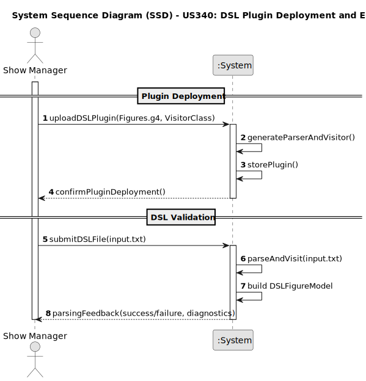

# US340 – DSL Plugin Deployment and Configuration

## 1. Requirements Engineering

### 1.1. User Story Description

**As a Drone Tech**, I want to **deploy and configure a plugin** to be used by the system to **analyze the figure high-level description**, so that the system can interpret, validate, and respond to domain-specific graphical inputs relevant to drone mission planning or spatial configuration.

---

### 1.2. Customer Specifications and Clarifications

This user story introduces a **plugin-based extension mechanism** that enables the analysis of **figure-based DSL descriptions** used to model drone environments and mission layouts.

- The plugin is implemented using **ANTLR (Listener/Visitor pattern)**, particularly a **Visitor**.
- The provided code (`DSLFigureVisitor.java`) defines how the input DSL file is parsed and interpreted into a semantic model.
- The plugin performs:
  - **Version detection**
  - **Drone type declarations**
  - **Variable handling** (Position, Velocity, Distance)
  - **Shape instantiation**
  - **Segment analysis** for drone movement logic
  - **Function and command parsing**
- The system uses the plugin to:
  - Validate DSL structure and semantics
  - Generate and return diagnostics
  - Construct a structured internal model (`DSLFigureModel`)

**Clarifications:**

- **Q: What is the plugin's core responsibility?**  
  **A:** To parse and interpret a high-level DSL description of spatial or behavioral aspects of drone missions.

- **Q: Which pattern must be used?**  
  **A:** The **Visitor** pattern is used (as implemented in `DSLFigureVisitor.java`).

- **Q: Is version tracking supported in the DSL?**  
  **A:** Yes, via the `visitVersionDecl` method.

- **Q: What happens if input is malformed or logic is invalid?**  
  **A:** Errors are logged, and the model may be incomplete. It’s up to the system to handle and display validation feedback.

- **Q: Can plugins be updated?**  
  **A:** Yes, Drone Techs may upload newer versions as needed.

---

### 1.3. Acceptance Criteria

- **AC1**: Only Drone Techs can upload and configure a DSL analysis plugin.
- **AC2**: The system must compile and validate the plugin on upload (must use Visitor-based logic).
- **AC3**: The plugin must parse a figure description DSL and produce a corresponding semantic model.
- **AC4**: Errors during parsing must be reported with useful diagnostics.
- **AC5**: A successful parse must result in a filled `DSLFigureModel` object containing all interpreted components.

---

### 1.4. Found out Dependencies

- **US210**: User authentication and role-based access control.
- **ANTLR4 tool**: Used for parser and lexer generation.
- **Visitor Implementation**: `DSLFigureVisitor.java` performs semantic construction.
- **LPROG Sprint Submission Requirements**:
  - Listener and Visitor usage is mandatory.
  - Output must be structured and explainable.
  - Work must be well documented and submitted to Moodle.

---

### 1.5. Input and Output Data

**Input Data:**

- DSL file (e.g., `figure_description.dsl`) with:
  - Drone type definitions
  - Position, distance, velocity variables
  - Shape instantiations
  - Segment definitions (`before`, `after`, `group`)
  - Command sequences and pauses

**Output Data:**

- Structured data model (`DSLFigureModel`) containing:
  - `version`, `droneTypes`, `positions`, `velocities`, `distances`, `shapes`, and `blocks`
- Console or log output:
  - Diagnostics for each parsed component
  - Error or status messages
- JSON or tree structure (optional) for system processing

---

### 1.6. System Sequence Diagram (SSD)

Below is the PlantUML source code for the System Sequence Diagram (SSD) of US251, showing the interaction between the system components responsible for language validation and parsing.

---

### 1.7 Other Relevant Remarks
