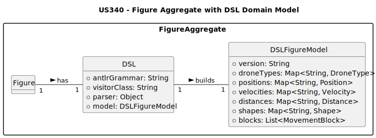

# US340 – Deployment and Configuration of DSL Plugin for Figure Analysis

## 2. Analysis

### 2.1. Relevant Domain Model Excerpt

Este diagrama apresenta o modelo de domínio focado na **implantação e uso de plugins DSL** para análise de descrições de figuras em drones. O objetivo é permitir que um **Drone Tech** faça upload e configure um **plugin DSL** que o sistema usará para interpretar e validar ficheiros de descrição de figuras (`input.txt`).

Este trecho do modelo destaca os seguintes elementos principais:

- **DSLPluginConfiguration** (`<<AggregateRoot>>`): Representa a configuração e estado de um plugin DSL associado ao sistema de drones.
- **DroneTech**: Usuário autorizado que pode fazer upload e configurar plugins DSL.
- **DSLPlugin**: Componente que contém a gramática ANTLR e as classes geradas para análise da linguagem DSL.
- **FigureDescriptionFile**: Ficheiro de entrada contendo a descrição da figura a ser analisada pelo plugin.
- **ParsingEngine**: Mecanismo interno do sistema responsável por compilar, carregar e executar o plugin DSL para análise dos ficheiros.
- **VisitorPatternImplementation**: Utiliza classes geradas pelo ANTLR (Visitors/Listeners) para construir o modelo abstrato (DSLFigureModel).
- **MakefileAutomation**: Suporte técnico para automatizar compilação, testes e execução do plugin DSL via comandos make.

#### **Explanation of the model elements**

- **DSLPluginConfiguration** (`<<AggregateRoot>>`): Representa a configuração do plugin DSL. Contém:
  - `antlrGrammar`: Gramática ANTLR usada pelo plugin (e.g., `Figures.g4`).
  - `visitorClass`: Classe Visitor gerada e personalizada (e.g., `DSLFigureVisitor.java`).
  - `pluginStatus`: Estado atual do plugin (e.g., `Ready`, `Error`).
- **DroneTech**: Usuário responsável pela implantação e configuração do plugin DSL no sistema.
- **DSLPlugin**:
  - `grammarFile`: Arquivo `.g4` da gramática ANTLR.
  - `generatedParserAndVisitor`: Código Java gerado pelo ANTLR e estendido com lógica de análise.
  - `modelBuilder`: Implementação Visitor que constrói o modelo de domínio da figura.
- **FigureDescriptionFile**: Arquivo `input.txt` contendo a descrição da figura para validação.
- **ParsingEngine**:
  - Processa a gramática ANTLR para gerar parser e visitor.
  - Executa a análise do ficheiro `input.txt` usando o plugin.
  - Retorna resultado da análise (modelo criado ou erros).
- **VisitorPatternImplementation**:
  - Classe `DSLFigureVisitor` visita nós da árvore sintática gerada pelo parser.
  - Constrói o modelo interno `DSLFigureModel` contendo tipos de drones, posições, segmentos, comandos, etc.
- **MakefileAutomation**:
  - Targets para gerar parser (`antlr`), compilar código (`compile`), executar testes e rodar análise (`run`).
  - Automatiza todo o fluxo de implantação e validação do plugin DSL.

---

### 2.2. Other Remarks

Este modelo enfatiza a arquitetura baseada em plugins e visitor pattern para análise flexível e extensível das linguagens DSL associadas a drones:

- **Modularidade**: O plugin DSL é carregado e gerenciado separadamente, permitindo atualizações independentes.
- **Flexibilidade**: Suporte a múltiplos tipos de figuras e comandos através da gramática ANTLR e da lógica Visitor.
- **Extensibilidade**: Novas versões do plugin podem ser implantadas sem impacto na infraestrutura do sistema.
- **Automação e Testabilidade**: A compilação e execução do plugin são automatizadas via Makefile, assegurando repetibilidade e validação contínua.
- **Segurança e Controle**: Apenas usuários autorizados (Drone Techs) podem fazer upload e configurar plugins.
- **Rigor e Confiabilidade**: O uso de ANTLR e Visitor garante a construção de modelos sintáticos e semânticos corretos para análise.

Este modelo fornece a base para garantir que as descrições de figuras utilizadas em drones sejam analisadas de forma robusta, configurável e sustentável, facilitando o desenvolvimento colaborativo e manutenção evolutiva da linguagem DSL.

