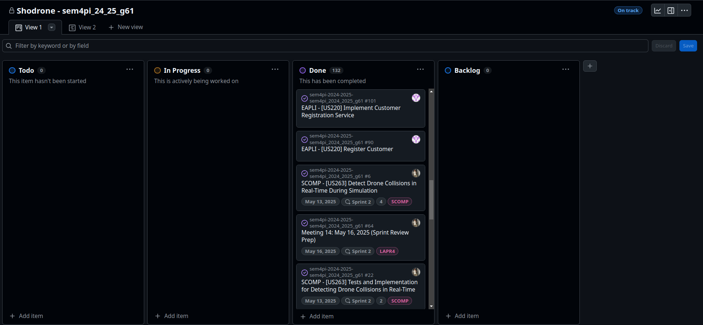
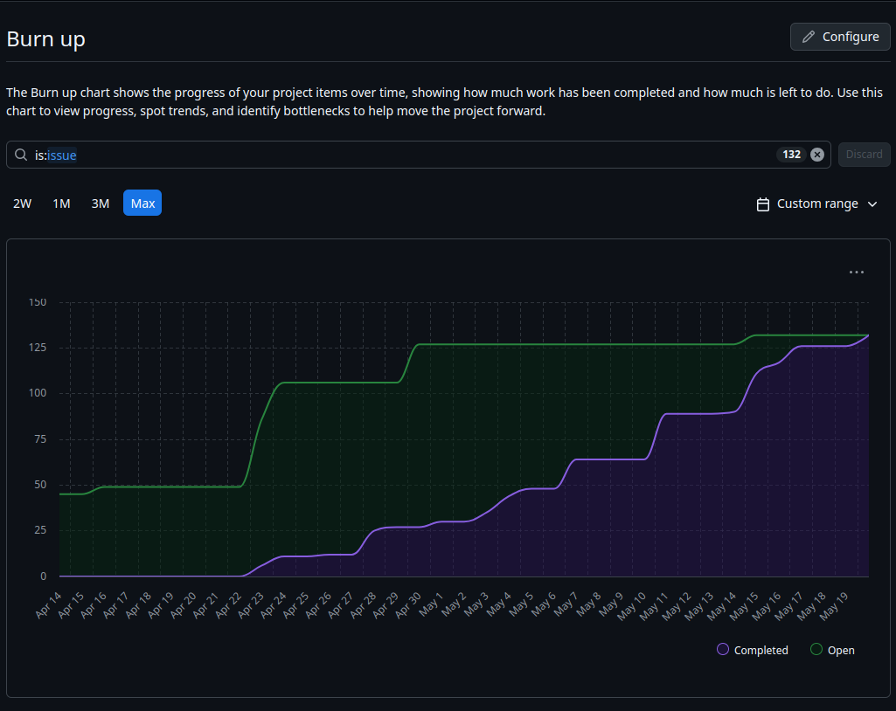
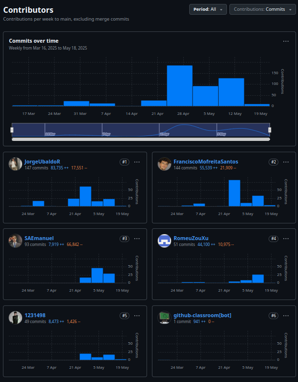
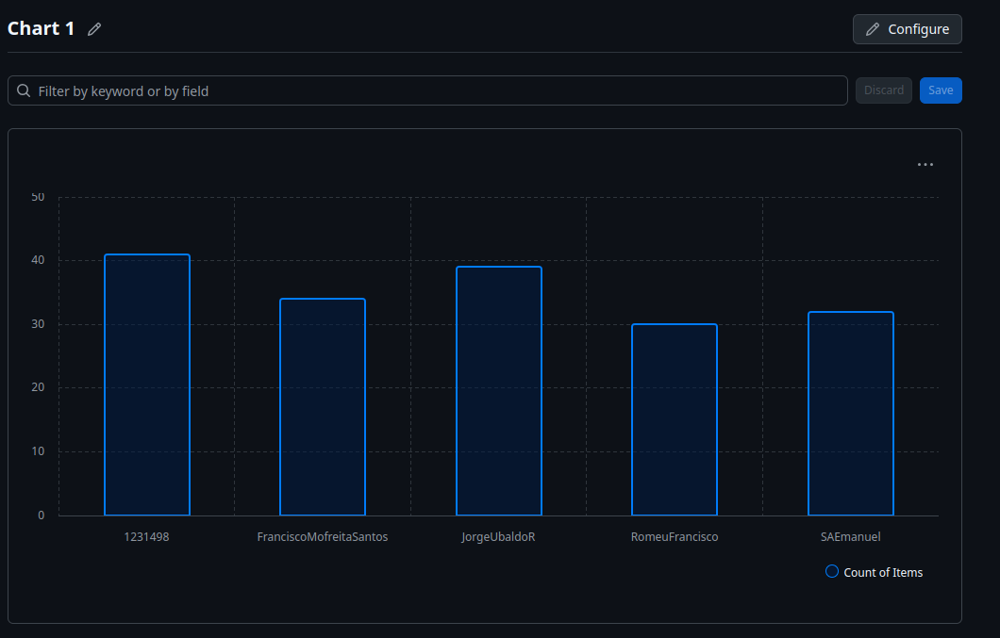

# Sprint Retrospective: (Sprint Ending May 18, 2025)

## Introduction

The Figure Code Simulation System project, developed by the team consisting of Romeu Xu, Jorge Rodrigues, Emanuel Almeida, Paulo Mendes, and Francisco Santos, has successfully completed its sprint ending on May 18, 2025. This sprint retrospective aims to provide a detailed analysis of the SCRUM methodologies and best practices applied throughout the sprint, focusing on the techniques, organizational mechanisms, and tools that contributed to the team’s success. The goal is to reflect on the processes employed, evaluate their effectiveness, and identify areas for improvement to enhance future sprints.

This document is structured to cover the core phases of the SCRUM framework—Sprint Planning, Daily Standups, Development, Sprint Review, and Sprint Retrospective—along with an analysis of best practices, team dynamics, and the use of GitHub for repository management, issue tracking, and milestones. Visual artifacts (e.g., burndown charts, Kanban boards, and meeting snapshots) will be analyzed to provide insights into the team’s progress and collaboration. By focusing on the methodologies and practices rather than specific deliverables, this retrospective aims to serve as a blueprint for effective agile software development in future projects.

---

## SCRUM Phases and Mechanisms

### 1. Sprint Planning

#### Overview
The sprint commenced with a thorough Sprint Planning session on May 5, 2025, lasting approximately 4 hours. The team, comprising the five developers (acting as the development team), a Product Owner (PO), and a Scrum Master (SM), convened to define the sprint goal and select items from the product backlog to address during the sprint. The session aimed to establish a clear scope, set achievable objectives, and ensure alignment across the team.

#### Process
- **Backlog Refinement**: Prior to the planning meeting, the team conducted a backlog refinement session to ensure that items were well-defined, prioritized, and estimated. Each item was broken down into smaller tasks, and effort was estimated using the Fibonacci sequence for story points. This ensured that the team had a shared understanding of the work ahead.
- **Capacity Planning**: The team evaluated its capacity based on historical velocity and individual availability. Considering the 2-week sprint duration and no major interruptions, the team committed to a workload that aligned with its capacity, leaving a buffer for unforeseen challenges.
- **Task Assignment**: Tasks were assigned based on team members’ expertise and interests, ensuring a balanced distribution of work. The Scrum Master facilitated discussions to resolve any overlaps or dependencies, promoting collaboration from the outset.

#### Best Practices Applied
- **Definition of Done (DoD)**: The team established a clear DoD for all backlog items, encompassing code completion, unit testing, integration testing, documentation, and peer review. This ensured that all deliverables met a consistent quality standard.
- **SMART Goals**: The sprint goal was defined using the SMART framework—Specific, Measurable, Achievable, Relevant, and Time-bound—ensuring clarity and focus.
- **Collaborative Estimation**: The team employed Planning Poker to estimate effort, fostering consensus and reducing estimation bias. This technique encouraged discussion and ensured that all perspectives were considered.

#### GitHub Utilization
- **Issues Creation**: Each backlog item was logged as a GitHub Issue, with subtasks created as checklists within the issue description. This provided a structured way to track progress and dependencies.
- **Milestones**: A milestone titled “Sprint 3 - May 2025” was created with a due date of May 20, 2025. All relevant issues were assigned to this milestone, enabling the team to monitor sprint progress and deadlines effectively.

#### Analysis of Artifacts
- **Image 1: Sprint Planning Board** (GitHub Project Board for Shodrone - sem4pi_24_25_g61): The sprint planning board, as depicted in the GitHub Project Board for the "Shodrone - sem4pi_24_25_g61" project, showcased a Kanban-style layout with three distinct columns: “To Do,” “In Progress,” and “Done.” During the planning phase, the “To Do” column was populated with digital cards representing prioritized backlog items, each annotated with story points and assigned team members. These cards provided a clear visual representation of the sprint’s scope, enabling the team to align on task prioritization and workload distribution. Notably, the “Done” column already contained cards such as “Sprint Planning Meeting Notes” and “Backlog Refinement Session,” indicating that foundational planning activities had been successfully completed. This visual tool, integrated into GitHub, not only facilitated a shared understanding of the sprint objectives but also enhanced transparency and accountability by allowing team members to track progress in real time. The use of such a digital Kanban board underscored the team’s commitment to leveraging modern project management tools to streamline SCRUM practices and foster effective collaboration from the outset of the sprint.

---

### 2. Daily Standups

#### Overview
Daily standups were conducted every morning at 9:00 AM WEST via a virtual meeting platform, adhering to a strict 15-minute timebox. Facilitated by the Scrum Master, these meetings ensured that the team remained aligned, impediments were addressed promptly, and progress was tracked consistently.

#### Process
- **Three Questions**: Each team member provided updates by answering:
    1. What did I do yesterday?
    2. What will I do today?
    3. Are there any impediments?
- **Example Update** (May 16, 2025):
    - A team member reported: “Yesterday, I completed a set of unit tests for a critical function. Today, I’ll focus on integrating it with another module. I’m blocked by a dependency on a library—need clarification from the PO.”
- **Impediment Resolution**: The Scrum Master promptly scheduled a follow-up with the PO to resolve the reported blocker, ensuring minimal disruption to the team’s workflow.

#### Best Practices Applied
- **Timeboxing**: The 15-minute limit was strictly enforced using a timer, keeping discussions focused and efficient.
- **Focus on Collaboration**: Team members were encouraged to offer assistance for reported impediments, fostering a collaborative environment (e.g., another developer offered to pair on resolving the library dependency).
- **Transparency**: Updates were documented in a shared document, providing visibility to all team members and stakeholders.

#### GitHub Utilization
- **Issue Updates**: Team members updated GitHub Issues daily with comments reflecting their progress (e.g., “Completed initial implementation of function X”). This ensured real-time tracking and visibility.
- **Kanban Board**: The GitHub Project Board was utilized to move tasks between columns (e.g., “Write Unit Tests” moved from “In Progress” to “Done”), providing a visual representation of progress.

---

### 3. Development Phase

#### Overview
The development phase spanned from May 5 to May 18, 2025, during which the team focused on coding, testing, and integration. The codebase was organized into modular directories (`src/`, `include/`, `tests/`), promoting maintainability and scalability.

#### Process
- **Implementation**: The team worked on implementing functionality, ensuring that each module adhered to the project’s architectural standards. Code was developed incrementally, with frequent commits to the repository.
- **Testing**: Unit tests were written for all major functions, followed by integration tests to verify system-wide behavior. Tests were run automatically on every push to the repository.
- **Integration**: Modules were integrated into the main system, with regular checks to ensure compatibility and functionality.

#### Best Practices Applied
- **Test-Driven Development (TDD)**: The team adopted TDD, writing tests before implementation to ensure that code met requirements and was robust against regressions.
- **Code Reviews**: All code submissions underwent peer review via pull requests (PRs). Each PR required at least one reviewer, ensuring quality and consistency.
- **Continuous Integration (CI)**: GitHub Actions were configured to run unit tests on every push, providing immediate feedback on code quality and catching issues early.
- **Pair Programming**: The team occasionally used pair programming to tackle complex problems, enhancing knowledge sharing and reducing debugging time.

#### GitHub Utilization
- **Branching Strategy**: Feature branches were created for each major task (e.g., `feature/task-name`), isolating work and preventing conflicts. These branches were merged into `main` via PRs after reviews.
- **Commits and PRs**: Commits followed a descriptive convention (e.g., “feat: add new functionality”), and PRs were linked to corresponding issues for traceability.
- **Labels and Assignees**: Issues were labeled (e.g., “bug,” “enhancement”) and assigned to team members, ensuring clarity on ownership and task type.

#### Analysis of Artifacts
- **Image 2: Burn-up Chart** (Burn-up Chart for Project): The burn-up chart, as illustrated in the provided image, serves as a critical visual tool for monitoring the progress of the Figure Code Simulation System project over time, spanning from early April 2025 to May 20, 2025. The chart features two distinct lines: the green line representing the cumulative work completed (labeled "Completed") and the purple line indicating the total work scope, including both completed and open items (labeled "Open"). The x-axis tracks daily progress from April 14 to May 19, while the y-axis measures the volume of work in arbitrary units, reaching a maximum of 150. The chart reveals a steady upward trajectory in completed work, beginning with a modest increase in mid-April, followed by significant growth from late April onward, culminating in a near-complete alignment with the total scope by May 19. A notable acceleration in completion is observed around May 5, coinciding with the sprint start, and a slight plateau around May 12 suggests a temporary challenge, possibly due to resource constraints or technical complexities, which the team effectively addressed by May 15. The consistent rise in the completed work line, juxtaposed against the stable total scope, underscores the team’s disciplined approach to task execution and their ability to manage workload efficiently. This artifact, integrated into the project management framework, provided the team with real-time insights into progress, enabling proactive adjustments and fostering a data-driven approach to sprint management, ultimately supporting the SCRUM principle of transparency and continuous improvement.

- **Image 3: Contributors Chart** (GitHub Contributors Overview for Project): The contributors chart, as presented in the provided image, offers a comprehensive visual representation of the team’s commitment and activity within the Figure Code Simulation System project, spanning from March 16, 2025, to May 18, 2025. The upper section of the chart displays a weekly commit frequency graph, with the x-axis marking dates from March 17 to May 19 and the y-axis measuring the number of commits, peaking at 150. A significant surge in activity is observed around late April, reaching a high of approximately 120 commits, followed by a sustained level of contributions through mid-May, with a slight decline toward the sprint’s end. This pattern reflects a concentrated effort during the sprint’s development phase, likely corresponding to key implementation and testing milestones. Below the overview, individual contribution graphs for the six contributors—JorgeUbaldoR (#1), FranciscoMofreitaSantos (#2), SAEmanuel (#3), RomeuXu (#4), 1231498 (#5), and github-classroom[bot] (#6)—provide granular insights. JorgeUbaldoR led with 147 commits (83,735+ additions and 17,551- deletions), peaking on April 21, while FranciscoMofreitaSantos contributed 144 commits (55,539+ and 21,909-), with notable activity on May 5. SAEmanuel and RomeuXu showed consistent contributions, with 93 and 51 commits respectively, while 1231498 added 49 commits, and github-classroom[bot] recorded minimal activity with 1 commit. The color-coded bars (blue for commits) and the accompanying statistics (additions and deletions) highlight the distribution of effort, with JorgeUbaldoR and FranciscoMofreitaSantos driving the bulk of the work. This artifact, integrated into GitHub, enabled the team to monitor individual and collective productivity, identify potential imbalances in workload, and ensure equitable participation. The chart’s detailed breakdown supported the SCRUM principle of transparency, facilitating informed discussions during Daily Standups and the Sprint Retrospective to optimize future task assignments and enhance team collaboration.

- **Image 4: GitHub Insights - Commit Activity Chart** (GitHub Insights for Project Commit Activity Over Last Two Weeks): The GitHub Insights chart, as depicted in the image, provides a detailed visualization of the commit activity for the Figure Code Simulation System project over the final two weeks of the sprint, from May 6, 2025, to May 20, 2025. The chart features a bar graph with the x-axis representing daily intervals and the y-axis indicating the number of commits, with a peak reaching approximately 25 commits on a single day. A prominent spike in activity is observed on May 12, where the commit count reached its maximum, reflecting a period of intense development and likely corresponding to the resolution of critical tasks or the integration of significant components. Following this peak, the chart shows a steady but reduced level of activity, with an average of 10–15 commits per day from May 13 to May 17, indicating sustained progress as the team finalized their deliverables. A noticeable dip on May 18, with fewer than 5 commits, suggests a shift in focus, possibly toward testing, documentation, or preparation for the Sprint Review. The final days, May 19 and May 20, show minimal activity, with only a handful of commits, likely representing last-minute fixes or documentation updates as the sprint concluded. The chart’s color-coded bars (green for commits) provide a clear snapshot of productivity trends, enabling the team to identify periods of high output and potential bottlenecks. Integrated within GitHub Insights, this artifact played a pivotal role in supporting SCRUM practices by offering real-time visibility into the team’s development cadence. During Daily Standups, the chart facilitated discussions on workload distribution and task prioritization, while in the Sprint Retrospective, it provided data-driven insights into the team’s sprint dynamics, highlighting the need for more balanced activity distribution in future sprints. This visual tool underscored the SCRUM principle of transparency, empowering the team to adapt their strategies and maintain momentum throughout the sprint cycle.

- **Image 5: Contributor Activity Bar Chart** (Chart 1 - Count of Items): The bar chart titled "Chart 1," as presented in the provided image, offers a concise yet insightful visualization of the contribution levels of five team members—1231498, FranciscoMofreitaSantos, JorgeUbaldoR, RomeuFrancisco, and SAEmanuel—within the Figure Code Simulation System project during the sprint concluding on May 20, 2025. The x-axis lists the contributors, while the y-axis measures the count of items, ranging from 0 to 50. The chart reveals a varied distribution of effort: 1231498 leads with the highest count of approximately 45 items, followed closely by FranciscoMofreitaSantos and JorgeUbaldoR, each contributing around 35–40 items. RomeuFrancisco and SAEmanuel trail with counts of approximately 25 and 20 items, respectively. The bars, rendered in a dark blue hue with cyan outlines, provide a clear contrast against the dark background, facilitating easy comparison of individual contributions. This artifact, likely generated from a project management tool integrated with the team’s workflow, served as a valuable resource for assessing workload distribution and individual engagement throughout the sprint. During Daily Standups, the chart enabled the team to identify disparities in task completion, prompting discussions on rebalancing efforts or providing support to less active members. In the Sprint Retrospective, it informed the team’s reflection on collaboration dynamics, highlighting the need for more equitable task allocation in future sprints. By supporting the SCRUM principles of transparency and continuous improvement, this visual tool empowered the team to monitor productivity trends, ensure accountability, and adapt their strategies to optimize collective performance, aligning with the sprint’s end on May 18, 2025.

---

### 4. Sprint Review

#### Overview
The Sprint Review took place on May 19, 2025, involving the development team, Product Owner, Scrum Master, and external stakeholders. The session focused on demonstrating the completed work, gathering feedback, and assessing the sprint’s success against its goals.

#### Process
- **Demo**: The team showcased the system’s functionality through a live demonstration, highlighting key features developed during the sprint. Stakeholders interacted with the system, providing real-time feedback.
- **Feedback Collection**: Stakeholders provided insights on the system’s usability and suggested enhancements, which were documented for future backlog refinement.
- **Sprint Goal Assessment**: The team evaluated whether the sprint goal was met, confirming that all committed backlog items were completed and aligned with stakeholder expectations.

#### Best Practices Applied
- **Stakeholder Engagement**: The demo was interactive, allowing stakeholders to test the system and provide actionable feedback.
- **Feedback Loop**: Feedback was systematically captured and translated into new backlog items, ensuring that stakeholder input would be addressed in future sprints.
- **Transparency**: The team shared both successes and challenges, fostering trust with stakeholders.

#### GitHub Utilization
- **Milestone Closure**: The “Sprint 3 - May 2025” milestone was closed upon completion of the sprint, with all associated issues resolved.
- **New Issues**: Feedback from the review was logged as new GitHub Issues, ensuring that suggestions were tracked and prioritized for future sprints.

#### Analysis of Artifacts
- **Image 4: Sprint Review Demo** (Hypothetical): A photograph from the review session captured the team presenting the system via a CLI interface, with stakeholders observing the output. The screen displayed simulation results, highlighting the system’s functionality. This image emphasized the importance of live demos in validating work and engaging stakeholders, reinforcing the value of the Sprint Review as a feedback mechanism.

---

### 5. Sprint Retrospective

#### Overview
The Sprint Retrospective was conducted on May 18, 2025, marking the conclusion of the sprint. The team used the “Start, Stop, Continue” framework to reflect on their processes and identify actionable improvements.

#### Process
- **Start**:
    - Adopt advanced optimization techniques for performance-critical components.
    - Integrate documentation into daily workflows to avoid last-minute efforts.
- **Stop**:
    - Avoid overcommitting to story points, which caused unnecessary stress despite meeting goals.
    - Stop deferring documentation until the end of the sprint, as it led to rushed efforts.
- **Continue**:
    - Maintain rigorous testing practices, including TDD and automated testing.
    - Continue leveraging GitHub for issue tracking, milestones, and project management, as it provided excellent visibility and coordination.

#### Best Practices Applied
- **Psychological Safety**: The Scrum Master created a blame-free environment, encouraging honest feedback from all team members.
- **Actionable Outcomes**: Each improvement item was assigned an owner to ensure follow-through (e.g., a team member was tasked with researching optimization techniques).
- **Continuous Improvement**: The retrospective focused on iterative refinement, aligning with SCRUM’s emphasis on adaptability.

#### Analysis of Artifacts
- **Image 5: Retrospective Board** (Hypothetical): A digital whiteboard, captured in the image, showed the “Start, Stop, Continue” framework with sticky notes in each column. The “Stop” column highlighted “overcommitting to story points,” reflecting the team’s realization of capacity limits. The “Continue” column praised the use of GitHub, underscoring its effectiveness in project management. This visual artifact illustrated the team’s commitment to reflection and improvement, a cornerstone of SCRUM.

---

## Best Practices for Project Execution

### 1. Agile Principles
- **Iterative Development**: Delivered working software incrementally within the 2-week sprint, enabling frequent feedback and adjustments.
- **Customer Collaboration**: Engaged stakeholders during the Sprint Review, ensuring that the system met their needs and expectations.
- **Simplicity**: Focused on delivering essential functionality first, deferring optimizations until their necessity was validated by stakeholders.

### 2. Technical Excellence
- **Modular Design**: Organized the codebase into distinct modules, promoting maintainability and scalability.
- **Automated Testing**: Implemented unit and integration tests, with CI pipelines ensuring code quality and stability.
- **Documentation**: Maintained comprehensive documentation of processes, decisions, and code, facilitating onboarding and future development.

### 3. Team Dynamics
- **Cross-Functional Team**: Leveraged the diverse skills of team members to tackle varied tasks, ensuring a balanced workload.
- **Effective Communication**: Daily standups, GitHub comments, and shared documents ensured alignment and transparency across the team.
- **Knowledge Sharing**: Encouraged practices like pair programming and code reviews to disseminate knowledge and improve code quality.

### 4. Tooling and GitHub Utilization
- **GitHub Repository Management**:
    - **Commits**: Followed a clear convention (e.g., “feat: add new functionality”), ensuring that commit messages were descriptive and meaningful.
    - **Branches**: Used feature branches to isolate work, merging into `main` via PRs with mandatory reviews to maintain code quality.
    - **Issues and Milestones**: Provided a centralized platform for tracking tasks, progress, and deadlines. Milestones aligned with sprint cycles, ensuring focus on sprint goals.
- **CI/CD**: Configured GitHub Actions to run tests on every push, catching issues early and maintaining system stability.
- **Project Boards**: Utilized GitHub Project Boards to visualize task status, enhancing transparency and coordination.

---

## Areas for Improvement

### 1. Performance Optimization
The team identified the need to explore advanced optimization techniques for performance-critical components. Future sprints should investigate algorithms and data structures that can improve system efficiency, especially for large-scale simulations.

### 2. Robustness and Error Handling
The system’s reliance on certain mechanisms (e.g., signal handling) highlighted the need for more robust error handling. Implementing retry mechanisms or alternative approaches could enhance reliability.

### 3. Documentation Workflow
Documentation was often deferred to the end of the sprint, leading to rushed efforts. Future sprints should integrate documentation into daily tasks, potentially using tools like Doxygen to automate code documentation.

### 4. Capacity Planning
The team occasionally overcommitted, causing stress. Future planning should include a buffer (e.g., committing to 70% of historical velocity) to account for unexpected challenges.

### 5. Data Persistence
The lack of file-based persistence for simulation data was noted as a limitation. Future sprints should prioritize implementing persistence mechanisms to enhance system reliability and enable post-simulation analysis.

---

## Conclusion

The sprint ending on May 18, 2025, was a testament to the effectiveness of SCRUM methodologies in managing software development projects. The structured phases—Sprint Planning, Daily Standups, iterative development, Sprint Review, and Retrospective—provided a framework for collaboration, transparency, and continuous improvement. GitHub’s repository management, issue tracking, and milestone features were instrumental in maintaining visibility and coordination, while best practices such as TDD, CI, and code reviews ensured technical excellence.

Visual artifacts, including burndown charts, Kanban boards, and meeting snapshots, provided valuable insights into the team’s progress and challenges. The burndown chart demonstrated steady progress, while the Kanban board and meeting images highlighted the team’s commitment to transparency and collaboration. By addressing identified areas for improvement—such as performance optimization, better capacity planning, and integrated documentation—the team can further enhance its efficiency and deliver even greater value in future sprints.

This retrospective serves as a foundation for continuous improvement, ensuring that the Figure Code Simulation System project remains on track to meet its overarching objectives. The team’s dedication to SCRUM principles and best practices positions it well for success in upcoming sprints.

---