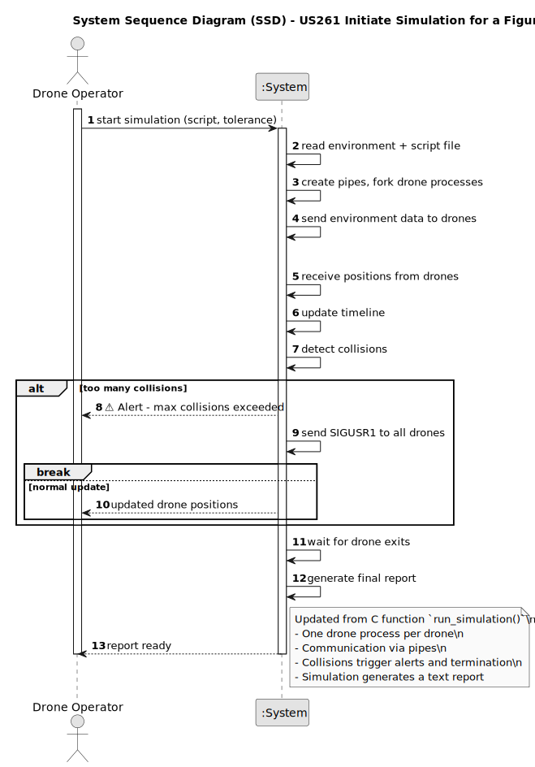

# US261 - Initiate Simulation for a Figure

## 1. Requirements Engineering

### 1.1. User Story Description

As a system user, I want to start a simulation process for a figure so that I can check for collisions before approving it. The system should fork a separate process for each drone, allowing them to execute their respective movement scripts in parallel. Communication between the main process and the drone processes should be managed via pipes and signals, enabling real-time position tracking and synchronization. This setup will allow the user to assess safety and correctness before executing the figure in a live show.

### 1.2. Customer Specifications and Clarifications

#### Customer Specifications
- The system must be implemented in **C** and utilize:
    - **Processes** (via `fork`)
    - **Pipes** (for inter-process communication)
    - **Signals** (for control flow and synchronization)
- Each drone in the figure must be executed as a **separate process**, responsible for its own movement logic.
- The **main process** must:
    - Launch all drone processes.
    - Track each drone’s position over time.
    - Manage communications through **pipes**.
    - Control execution with **signals** (e.g., `SIGUSR1`, `SIGCONT`).
- This setup is intended to simulate the movement of drones in a defined figure and detect potential collisions prior to real-world deployment.

#### Clarifications Based on Implementation
- Each drone process reads a predefined movement script (e.g., from file or shared memory) to simulate its trajectory.
- Pipes are used for each drone to send position updates to the main process at each simulation tick.
- The main process maintains a `historyOfRadar`-like structure to store the positional data of all drones.
- Simulation proceeds in discrete time steps, with the main process coordinating ticks and collecting updated positions.
- Signals are used for:
    - Starting or pausing simulation (`SIGUSR1`, `SIGCONT`)
    - Ending a drone’s simulation (`SIGTERM`)

#### Customer Forum Clarifications (Hypothetical, Based on Context)
- *Q: Can the simulation be stopped midway by the operator?*
    - *A: Yes, an interrupt signal (e.g., SIGINT) can halt the simulation, and all child processes should be gracefully terminated.*
- *Q: How are movement scripts defined and provided to each drone?*
    - *A: Each drone’s script is a predefined list of 3D positions indexed by time tick, either loaded from a file or constructed dynamically by the system.*

### 1.3. Acceptance Criteria

- **AC1**: The simulation component must be implemented in **C**, using **fork**, **pipes**, and **signals**.
- **AC2**: The system must **fork a new process for each drone** in the figure.
- **AC3**: Each drone process must execute its designated **movement script**, simulating position changes over time.
- **AC4**: **Pipes** must be established between the main process and each drone for **position data exchange** at each tick.
- **AC5**: The main process must maintain a data structure (e.g., `Radar historyOfRadar[drone_count][tick_count]`) to **track drone positions** over time.
- **AC6**: The simulation must support **synchronized execution**, with the main process coordinating simulation ticks and collecting data.
- **AC7**: The main process must be able to **pause, resume, and terminate** drone simulations using **signals**.

### 1.4. Found out Dependencies

- **US262 - Capture and process drone movements**  
  Dependency: US261 requires US262 to handle incoming position updates from drones and store them over time.

- **US263 - Detect drone collisions in real time**  
  Dependency: US261 initiates the simulation environment required by US263, which uses the live position data to detect collisions.

- **US264 - Synchronize drone execution with a time step**  
  Dependency: US261 depends on US264 to synchronize all drones, ensuring consistent simulation steps and data logging.

- **US265 - Generate a simulation report**  
  Dependency: US261 provides the execution context and position history required for US265 to generate post-simulation reports.

- **US266 - Incorporate environmental conditions into simulation**  
  (Optional) Dependency: If environmental factors are enabled, US261 must load and propagate this configuration to drone processes at simulation start.

### 1.5. Input and Output Data

# Input and Output Data

## Input Data

- **Figure Script Filename**  
  The filename argument passed to the simulation function (e.g., `"script_10_drones.txt"`), corresponding to a script file located in the `scripts/` directory.  
  This file includes drone configurations, number of drones, total simulation ticks, and movement instructions.

- **Environmental Configuration**  
  Loaded at simulation start by `read_enviroment_info(&environment)`.  
  Includes environmental factors such as wind speed and direction that affect drone trajectories.

- **Maximum Allowed Collisions**  
  Calculated using `calculate_acceptable_collision_number(num_drones, percentage)`, where `percentage` is a user-defined tolerance level for collisions.

---

## Output Data

- **Position Updates via Pipes (`position_pipes`)**  
  Each drone process sends its current position as a `Position` struct to the main process every simulation tick.

- **Collision Events (`Collision_Stamp` array)**  
  Logs collision timestamps and positions dynamically detected during the simulation.

- **Simulation Report (`Report`)**  
  A report file generated at simulation end (e.g., `./reports/report_script_10_drones.txt_1.txt`) containing:
    - Total number of drones
    - Total simulation ticks
    - Number and details of collisions
    - Pass/fail validation status

### 1.6. System Sequence Diagram (SSD)

### 1.7. Other Relevant Remarks

#### Implementation Details Based on Simulation Logic
- The main process performs the following:
    - Parses input configuration for the figure.
    - Forks a child process for each drone.
    - Creates a pipe (or pair of pipes) for each drone to allow bidirectional communication.
    - Signals drone processes to start or pause execution.
    - Collects position updates via pipes at each tick and stores them in `historyOfRadar`.
- Each drone process:
    - Loads or is provided its movement script.
    - Waits for a signal from the main process to begin.
    - Sends current position to main process at each tick via pipe.
    - Waits for tick signal or termination signal.

#### Helper Functions and Modules
- `create_pipes`: Establishes communication channels between main and drone processes.
- `fork_drone_processes`: Handles process creation, assigning each one its movement script.
- `read_from_pipe`: Main process uses this to read position updates from drones.
- `send_signal_to_drones`: Centralized function to pause/resume/terminate drones.
- `update_history`: Records received drone positions in the main data structure.

#### Operational Context
- The simulation is intended to be used in development and pre-flight validation phases.
- It ensures that no drone paths intersect dangerously before physical deployment.
- Drones are expected to behave deterministically, following preloaded movement instructions.

#### Potential Limitations
- Simulation does not currently support:
    - Dynamic trajectory updates during runtime.
    - Prediction-based collision avoidance (relies on `US263` for post-facto detection).
- Pipes may have performance limitations with very high drone counts or long simulations unless optimized.

#### Future Considerations
- Add support for **shared memory** for more efficient.
- Add **simulation replay** capabilities.

